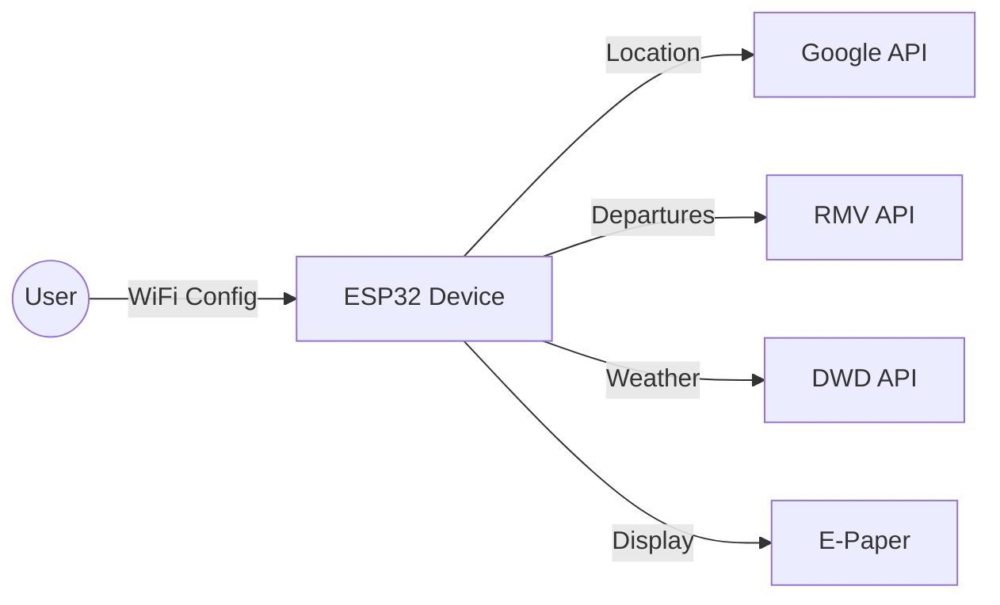

# MyStation

> ESP32-powered e-paper display showing real-time public transport departures and weather information

[](https://platformio.org/)
[](https://www.espressif.com/en/products/socs)

## ✨ Features

- 🚌 **Real-time departures** from German public transport (RMV API)
- 🌤️ **Weather information** from German Weather Service (DWD)
- 📱 **Mobile-friendly web configuration** - no app installation needed
- 🔋 **Ultra-low power** with deep sleep (months of battery life)
- 📡 **WiFi connectivity** with automatic location detection
- 🔒 **Privacy-focused** - all processing happens locally on device
- 🎨 **E-paper display** - outdoor-readable, low power consumption
- 🔘 **Physical buttons** - quickly switch display modes
- 🔄 **OTA updates** - update firmware over WiFi

## 🎯 Supported Hardware

- **ESP32-C3 Super Mini** - Compact, cost-effective
- **ESP32-S3** - Enhanced performance, battery monitoring
- **7.5" E-Paper Display** (800x480) - GDEY075T7 or compatible

## 🚀 Quick Start

### 1. Hardware Assembly

Wire your ESP32 to the e-paper display. See detailed pin connections:

- **[Hardware Assembly Guide](./docs/developer-guide/hardware-assembly.md)** - Wiring diagrams for ESP32-C3 and ESP32-S3

### 2. Firmware Setup

```bash
# Clone repository
git clone https://github.com/yourusername/mystation.git
cd mystation

# Build and upload with PlatformIO
pio run --target upload
pio run --target uploadfs
```

### 3. Device Configuration

1. Power on your device
2. Connect to `MyStation-XXXXXXXX` WiFi network
3. Open browser and configure:
    - Your home WiFi network (2.4 GHz only)
    - Preferred transport station
    - Display preferences

**📖 [Complete Quick Start Guide](./docs/user-guide/quick-start.md)**

## 📚 Documentation

### For Users

- 📖 **[User Guide](./docs/user-guide/index.md)** - Setup, usage, and troubleshooting
- 🚀 **[Quick Start](./docs/user-guide/quick-start.md)** - Get running in 15 minutes
- 🔘 **[Button Controls](./docs/user-guide/button-controls.md)** - Using physical buttons
- 📱 **[Understanding Display](./docs/user-guide/understanding-display.md)** - Display modes explained
- 🔧 **[Troubleshooting](./docs/user-guide/troubleshooting.md)** - Common issues and solutions

### For Developers

- 💻 **[Developer Guide](./docs/developer-guide/index.md)** - Architecture and development
- 🔧 **[Hardware Assembly](./docs/developer-guide/hardware-assembly.md)** - Pin connections and wiring
- ⚙️ **[Development Setup](./docs/developer-guide/development-setup.md)** - Build environment
- 🧪 **[Testing](./docs/developer-guide/testing.md)** - Testing procedures
- 📋 **[Run Book](./docs/developer-guide/run-book.md)** - Operational procedures
- 🔑 **[API Integration](./docs/developer-guide/api-integration.md)** - Setting up API keys
- 🎨 **[Display System](./docs/developer-guide/display-system.md)** - Display architecture
- 🔄 **[Boot Process](./docs/developer-guide/boot-process.md)** - Device boot flow

### Reference

- 📚 **[Configuration Keys](./docs/reference/configuration-keys-quick-reference.md)** - All configuration options

## 🏗️ Architecture

MyStation is designed for simplicity and efficiency:

- **ESP32 Controller** - Manages WiFi, deep sleep, and data fetching
- **E-Paper Display** - Low-power outdoor-readable screen
- **Web Interface** - Easy configuration via WiFi
- **APIs** - Google Geolocation, RMV Transport, DWD Weather
- **Deep Sleep** - Battery-optimized operation

### Data Flow



**📖 [Detailed Architecture](./docs/developer-guide/index.md)**

## 🎨 Display Modes

MyStation supports three display modes:

- **Half & Half** - Weather + Departures side-by-side (landscape)
- **Weather Only** - Full screen weather information
- **Departures Only** - Full screen departure board

Switch modes using physical buttons or web interface.

**📖 [Display System Documentation](./docs/developer-guide/display-system.md)**

## 🔋 Power & Battery

- **Deep Sleep**: <50μA between updates
- **Active Mode**: ~100mA during data fetch
- **Battery Life**: 2-4 months with 2500mAh battery (5-minute updates)
- **Smart Scheduling**: Reduced updates during night hours

**📖 [Boot Process & Power Management](./docs/developer-guide/boot-process.md)**

## 🌍 Coverage

- **Transport**: Hesse, Germany (RMV network)
    - Frankfurt, Wiesbaden, Kassel, Darmstadt, etc.
    - Trains, buses, trams, S-Bahn
- **Weather**: Germany and surrounding areas (DWD)
- **Extensible**: Adapt for other regions/APIs

## 🛠️ Development

### Prerequisites

- PlatformIO IDE (VS Code recommended)
- ESP32-C3 or ESP32-S3 development board
- API keys (Google, RMV)

### Project Structure

```
├── docs/                   # Documentation
├── include/               # Header files
│   ├── api/              # API interfaces
│   ├── config/           # Configuration
│   └── util/             # Utilities
├── src/                  # Source code
│   ├── api/             # API implementations
│   ├── config/          # Configuration management
│   ├── display/         # Display rendering
│   └── main.cpp         # Main application
├── test/                # Unit tests
└── platformio.ini       # Build configuration
```

### Contributing

1. Fork the repository
2. Create feature branch
3. Test thoroughly
4. Submit pull request

**📖 [Development Guide](./docs/developer-guide/index.md)**

## 📄 License

MIT License

---

**🚀 Ready to build your own departure board?**
**[Start with the Quick Start Guide →](./docs/user-guide/quick-start.md)**
