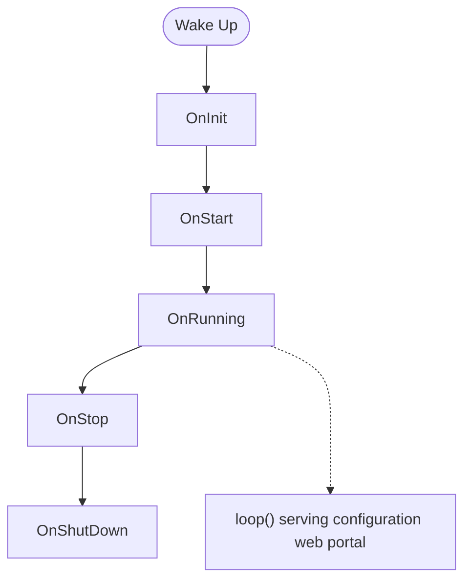
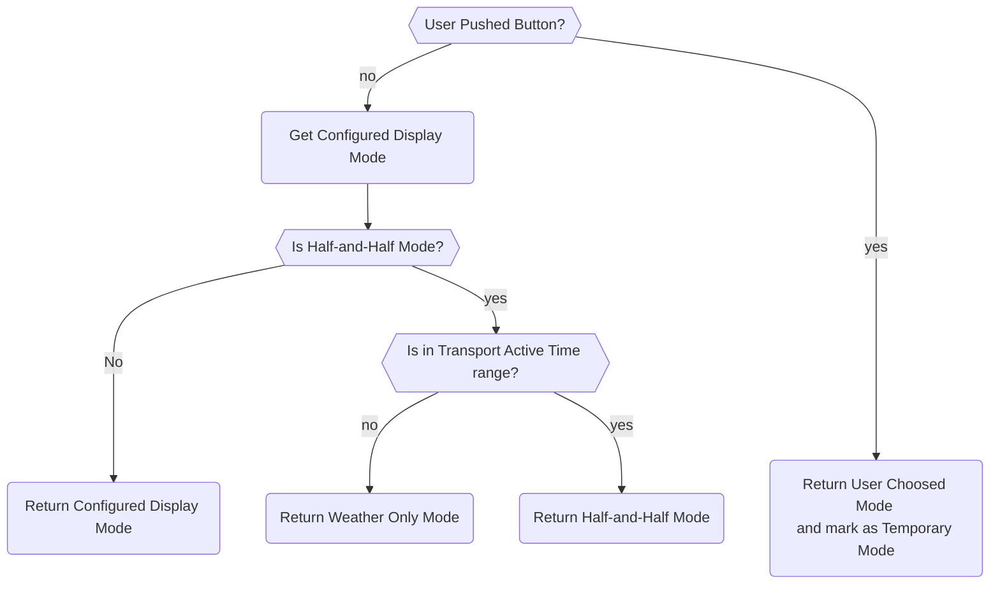
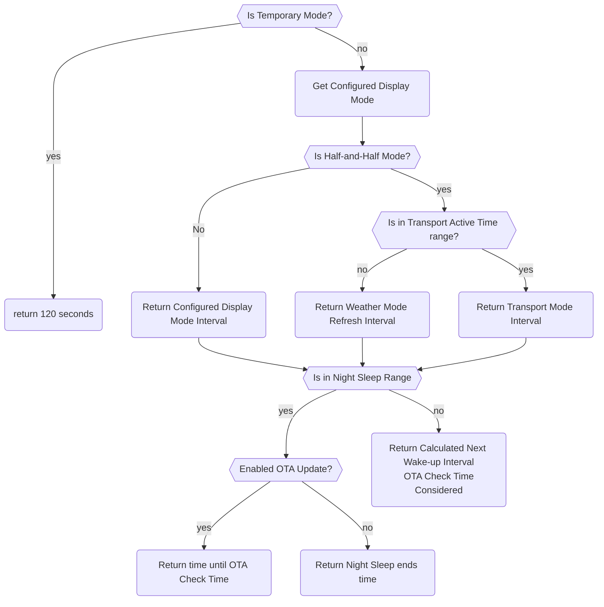

# Lifecycle

MyStation uses a sophisticated multi-phase Lifecycle that adapts based on the device's configuration state. This
ensures a smooth user experience from first boot through normal operation.

## Life Cycle Diagram



## Detailed Boot Life Cycle

There are five main Life Cycle phases during the boot process.
It usually goes through all phases in order.
But, Some Phase can be skipped or getting into looped, based on the next lifecycle state.
_loop_ indicates the ESP32 Arduiono loop() function,
which is serving the configuration http web portal.

**Key Actions**:

1. OnInit: System Initialization Phase which initializes global instances
    - Initialize Serial Communication if needed
    - Print Wake-up Diagnostics
    - Check If factory Reset is desired
    - Initialize Display
    - Initialize Font
    - Initialize Battery Monitoring if the board supports
    - Check Battery Level, if it is too low, show Battery Low Screen, jump to OnShutDown, if the board supports
    - Load configuration from NVS
1. OnStart: Before Operational Phase, configure network, buttons and time
    - Start configuration Phase 1 if needed : Wifi Manager Configuration starts
    - Start Wifi connection. If it gets failed, show Wifi Error Screen, jump to OnStop
    - Set up Time if it needed
    - Setup by pressing buttons changes display mode while running - To do
    - Set temporary display mode if needed - To Move
1. OnRunning: Operational Phase which needs Internet access
    - Start configuration Phase 2 if needed : Application Configuration, jump to loop
    - OTA Update Check if needed
    - Fetch Data from APIs and Update Display
1. OnStop: Prepare to Deep Sleep Phase
    - Calculate next wake-up time
    - clean up temporary states if needed - To do
    - Setup awake buttons peripherals before ESP32 deep sleep
1. OnShutDown: Deep Sleep Phase
    - Turn off peripherals
    - Enter deep sleep

## Operation Modes

There are three Operation Modes. `Wifi Configuration Mode`, `Application Configuration Mode`, and `Running Mode`.
The Operation Mode is determined by the current Configuration State.

If it has Wifi credentials and internet is accessable, it goes to Configuration Mode 2.
If it has required Application settings, it goes to Running Mode.

### Wifi Configuration Mode

Check if Wifi is configured. If not,
It configures WiFi connection settings via WiFi Manager.

### Application Configuration Mode

Check if Application settings are configured. If not,
It configures Application settings via Web Configuration Portal.

***It needs internet access to get current location, nearby stations, getting city name, longitude and latitude***

### Running Mode

It fetches data from APIs and updates the display.

## Display Mode

While in Running Mode, it determines which Display Mode to apply.
There are three Display Modes. `Weather Only`, `Transport Only`, and `Half-and-Half`.
By `Half-and-Half` Mode, it also considers Transport Active Time Range settings to determine
to show `Half-and-Half` or `Weather Only`.
There are also `Temporary Mode` which is applied when user presses buttons which precedent the display mode.



### Weather Data Caching

Weather Data is not actively changed very often. So it is cached in RTC Memory. if the cached data is expired,
it will be fetched again from the API server. Cache Expire time is 60 minutes default.
If user changes the display mode by pushing buttons, the weather data is not refreshed until the cache expires.
However, Transport Data is actively changed. So it is always fetched from the API server on each update cycle.

## ESP32 Deep Sleep time calculation process

Before entering deep sleep, it calculates the next wake-up time based on the configured update interval.
There are multiple factors to consider when calculating the next wake-up time:

- Current time
- Current Display Mode
- Is next wake-up time in Night Sleep Range
- OTA Check Time
- Configured update interval
- Transport Active Time Range (if applicable)
- Temporary display mode duration (if applicable)
- Ensuring a minimum sleep duration to avoid rapid wake-sleep cycles

***`Night Sleep` indicatest the user configured `deep sleep` time range, Todo: avoid of misleading wording ESP32
`deep sleep`***



### Entering Deep Sleep

before it gets into deep sleep, it enables wake-up sources and enters deep sleep mode.

```cpp
void enterDeepSleepWithButtonWakeup(uint32_t seconds) {
    // 1. Enable timer wake-up
    esp_sleep_enable_timer_wakeup(seconds * 1000000ULL);

    #ifdef BOARD_ESP32_S3
    // 2. Enable button wake-up
    esp_sleep_enable_ext0_wakeup(GPIO_BUTTON_1, 0);  // LOW
    esp_sleep_enable_ext0_wakeup(GPIO_BUTTON_2, 0);
    esp_sleep_enable_ext0_wakeup(GPIO_BUTTON_3, 0);
    #endif

    // 3. Enter deep sleep
    ESP_LOGI(TAG, "Entering deep sleep");
    esp_deep_sleep_start();
}
```

### Wake-up Sources

1. **Timer**: Scheduled update interval
2. **Button**: User pressed button (ESP32-S3)
3. **Reset**: Manual reset button pressed

### After Wake-up

It checks the wake-up reason and logs it.

```cpp
void checkWakeupReason() {
    esp_sleep_wakeup_cause_t cause = esp_sleep_get_wakeup_cause();

    switch (cause) {
        case ESP_SLEEP_WAKEUP_TIMER:
            ESP_LOGI(TAG, "Woken by timer");
            break;

        case ESP_SLEEP_WAKEUP_EXT0:
        case ESP_SLEEP_WAKEUP_EXT1:
            ESP_LOGI(TAG, "Woken by button");
            break;

        default:
            ESP_LOGI(TAG, "Not a deep sleep wake");
            break;
    }
}
```
