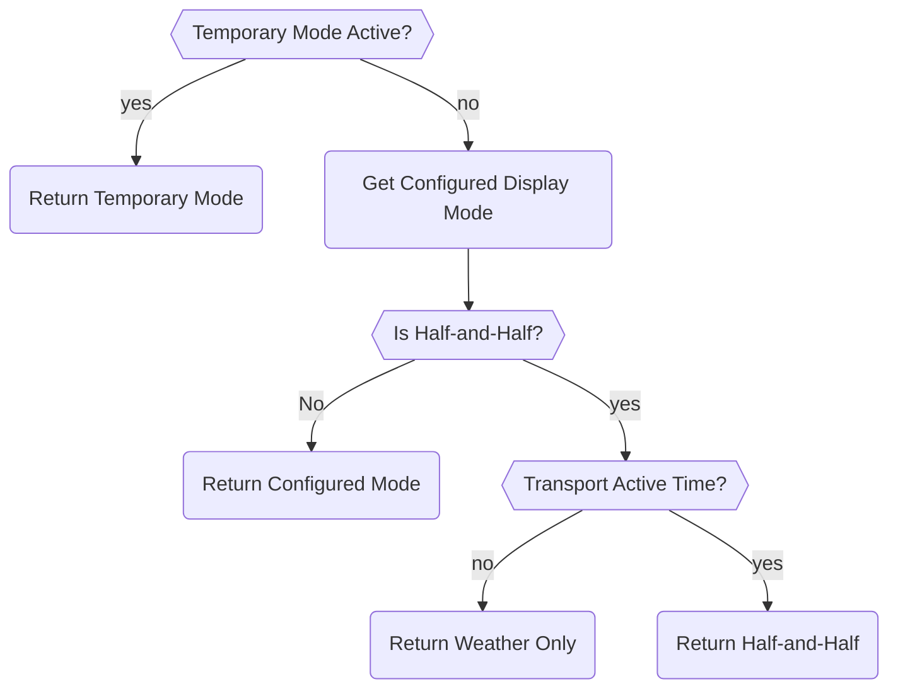

# Lifecycle

MyStation uses a multi-phase lifecycle that adapts based on the device's configuration state.

## Lifecycle Diagram


```mermaid
flowchart TD
    Start([Wake Up]) --> OnInit
    OnInit --> OnStart
    OnStart --> OnRunning
    OnRunning --> OnStop
    OnStop --> OnShutDown
    OnRunning -.-> OnLoop
    OnLoop["ON_LOOP: serving configuration web portal"]
    OnInit -->|battery low| OnShutDown
    OnStart -->|WiFi failed| OnStop
```

## Lifecycle Phases

There are six lifecycle states. The device usually progresses linearly through them,
but can skip phases or branch based on conditions.

### ON_INIT: System Initialization

- Initialize Serial (debug builds only)
- Print wake-up diagnostics
- Check for factory reset (Button 1+2 held), app reset (Button 1 held), application info (Button 2 held), or OTA update (Button 3 held)
- Initialize e-paper display and font renderer
- Initialize battery monitoring (ESP32-S3 boards)
- If battery voltage is critically low (>0.1V and ≤3.0V), show error and jump to ON_SHUTDOWN
- Load configuration from NVS (or use RTC cache after deep sleep)
- Configure button GPIO pins and attach interrupts

### ON_START: Network & Time Setup

- Determine configuration phase (WiFi Setup / App Setup / Complete)
- If Phase 1 (no WiFi): start WiFi AP, block until configured, then `ESP.restart()`
- Connect to WiFi. If connection fails → show error, jump to ON_STOP
- Synchronize time via NTP (if needed or periodic refresh due)
- Handle button wakeup: set temporary display mode if woken by button press

### ON_RUNNING: Operational Phase

- If Phase 2 (app setup needed): start configuration web server, transition to ON_LOOP
- Check for OTA update (if scheduled time matches)
- Fetch data from APIs (Phase 3: Complete)
- Disconnect WiFi (saves ~100mA during display rendering)
- Render display

### ON_LOOP: Web Server Mode

- Serves the configuration HTTP portal
- Runs inside `setup()` as an inline while-loop (not Arduino's `loop()`)
- Exits when configuration is saved (device enters deep sleep and restarts)

### ON_STOP: Prepare for Deep Sleep

- Calculate next wake-up time via `TimingManager::getNextSleepDurationSeconds()`
- Configure button wakeup pins for deep sleep

### ON_SHUTDOWN: Enter Deep Sleep

- Final button-press check (restart if pressed during wake cycle)
- Hibernate display (power off e-paper controller)
- Enter ESP32 deep sleep with timer + button wakeup sources

## Button-Interrupt-Restart Pattern

Throughout ON_START, ON_RUNNING, and ON_SHUTDOWN, the system calls
`ButtonManager::checkAndRestartIfButtonPressed()` at multiple points.
If a button was pressed via ISR during the current wake cycle, the device
calls `esp_restart()` to handle the button press cleanly from the beginning.
This avoids complex mid-cycle state changes.

## Configuration Phases

The configuration phase is determined by `DeviceModeManager::getCurrentPhase()`:

| Phase | Condition | Action |
|-------|-----------|--------|
| PHASE_WIFI_SETUP | No WiFi SSID stored | Start WiFi AP for configuration |
| PHASE_APP_SETUP | WiFi OK, but missing stop/location | Start web config portal |
| PHASE_COMPLETE | All required settings present | Normal operation |

## Display Mode Selection

Display mode is determined by `TimingManager::getEffectiveDisplayMode()`:


```mermaid
flowchart TD
    is_temp{{Temporary Mode Active?}} -->|yes| show_temp(Return Temporary Mode)
    is_temp -->|no| get_config(Get Configured Display Mode)
    get_config --> is_halfNhalf{{Is Half-and-Half?}}
    is_halfNhalf -->|No| show_configured(Return Configured Mode)
    is_halfNhalf -->|yes| is_transport_active{{Transport Active Time?}}
    is_transport_active -->|no| show_weather(Return Weather Only)
    is_transport_active -->|yes| show_halfNhalf(Return Half-and-Half)
```

Temporary mode is activated by button press and lasts 2 minutes, then reverts to configured mode.

### Weather Data Caching

Weather data is cached in RTC memory. It is only re-fetched when the configured interval
(default: 1-3 hours) has elapsed. Transport data is always fetched fresh on each wake cycle.

## Deep Sleep Duration Calculation

The sleep duration calculator uses a **rule-based priority queue**. Each rule independently
proposes a wake-up time. The system picks the earliest.

### Terminology

| Term | Meaning |
|------|---------|
| **Transport window** | Time range when departures are shown (e.g. 06:00–09:00) |
| **Sleep window** | Time range when the device stays in deep sleep (e.g. 22:30–05:30) |
| **Wake candidate** | A proposed wake-up time from a rule |

### Rules

| # | Rule | When it applies | Bypasses Sleep Window |
|---|------|----------------|----------------------|
| 1 | Weather update | All modes showing weather (weather-only, half&half) | No |
| 2 | Transport update | Inside transport window (half&half, transport-only) | No |
| 3 | Transport window start | Configured half&half or transport-only, currently outside window | No |
| 4 | OTA check | OTA enabled | **Yes** |

### Algorithm

```
1. TEMPORARY MODE (early return)
   → If temp mode active and < 2 min elapsed: sleep remaining time
   → If in sleep window: sleep until sleep window ends

2. COLLECT CANDIDATES
   → Each rule proposes a wake-up timestamp

3. OVERDUE CHECK
   → If any candidate is in the past → wake immediately (30s)

4. SLEEP WINDOW FILTER
   → Non-OTA candidates inside sleep window are pushed to sleep window end
   → OTA candidates bypass this filter

5. PICK EARLIEST
   → Minimum of all remaining candidates
   → Enforce 30s minimum
```

### Display Mode Logic

| Configured Mode | Inside Transport Window | Outside Transport Window |
|-----------------|------------------------|--------------------------|
| **Weather Only** | Rule 1 (weather) | Rule 1 (weather) |
| **Half & Half** | Rule 1 + Rule 2 (picks earlier) | Rule 1 + Rule 3 (picks earlier) |
| **Transport Only** | Rule 2 (transport) | Rule 3 (next window start) |

### Sleep Window Handling

When a wake candidate falls inside the sleep window:

```
  22:00       22:30          05:30       06:00
    |           |    SLEEP    |           |
    |           |=============|           |
    |      ┌────┼──── X ─────┼──→ pushed to 05:30
    |      |    |             |
  candidate    sleep start   sleep end
  (23:00)
```

- Non-OTA candidates are pushed to sleep window end
- OTA candidates are NOT pushed (they bypass the sleep window)
- If already inside the sleep window, device sleeps until window ends

### Examples

**7:00 AM, Half & Half mode, transport window 06:00–09:00:**
- Rule 1: weather at 10:00 (3h interval)
- Rule 2: transport at 7:05 (5 min interval)
- Rule 3: not applicable (already inside window)
- → Picks 7:05 (transport, earliest)

**5:00 AM, Half & Half mode, transport window 06:00–09:00:**
- Rule 1: weather at 8:00 (3h interval)
- Rule 2: not applicable (outside window)
- Rule 3: transport window starts at 6:00
- → Picks 6:00 (transport window start, earliest)

**22:00, Weather Only, sleep window 22:30–05:30:**
- Rule 1: weather at 23:00 → pushed to 05:30
- → Picks 05:30

**22:00, OTA at 03:00, weather at 23:00, sleep window 22:30–05:30:**
- Rule 1: weather at 23:00 → pushed to 05:30
- Rule 4: OTA at 03:00 (bypasses sleep window)
- → Picks 03:00 (OTA, earliest)

## Wake-up Sources

1. **Timer**: Scheduled update interval
2. **Button EXT1**: User pressed a physical button (ESP32-S3 only)
3. **Reset**: Manual reset or power cycle
