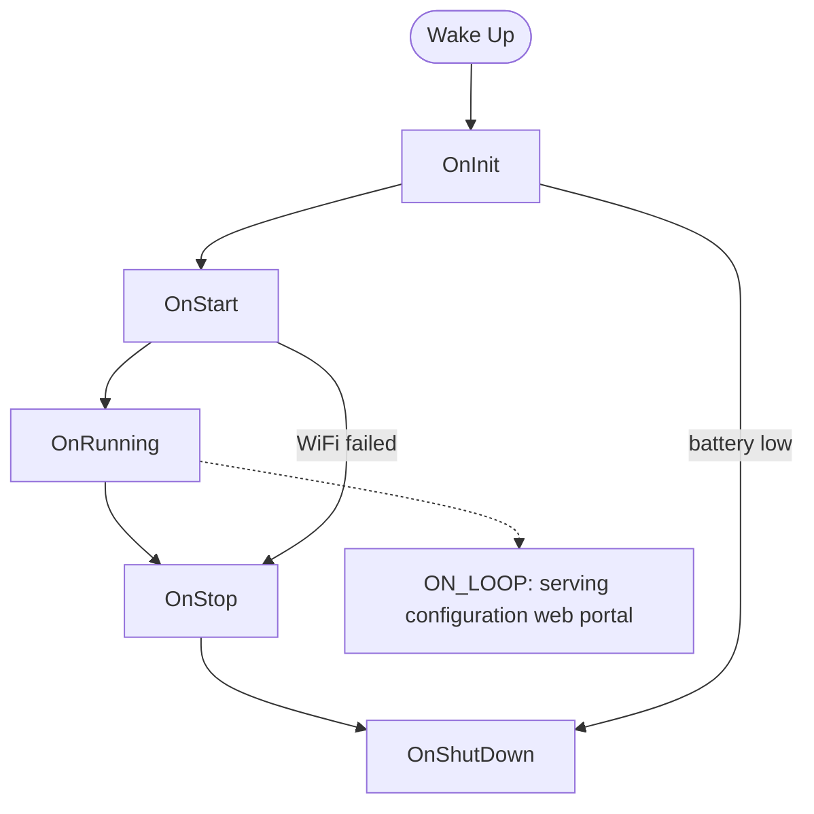
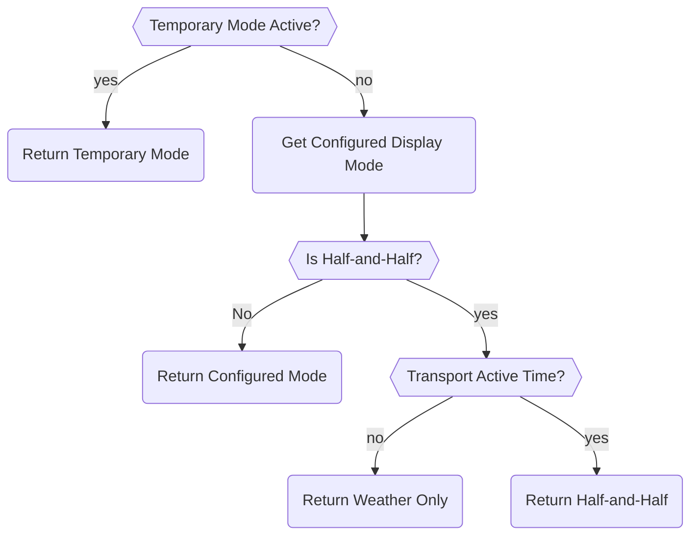
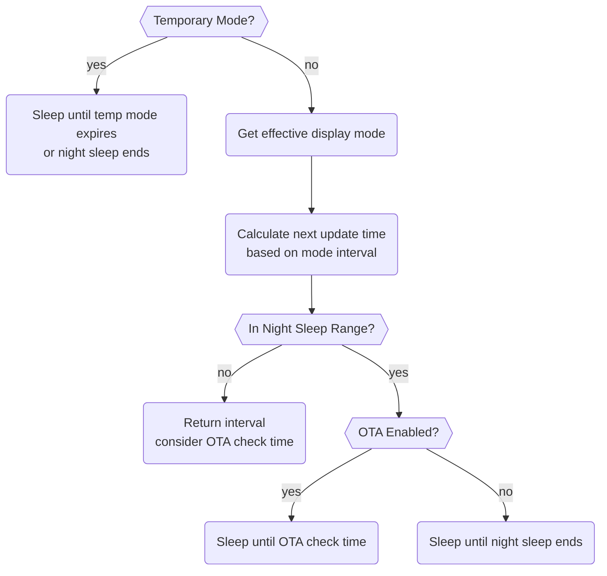

# Lifecycle

MyStation uses a multi-phase lifecycle that adapts based on the device's configuration state.

## Lifecycle Diagram

```mermaid
flowchart TD
    Start([Wake Up]) --> OnInit
    OnInit --> OnStart
    OnStart --> OnRunning
    OnRunning --> OnStop
    OnStop --> OnShutDown
    OnRunning -.-> OnLoop
    OnLoop["ON_LOOP: serving configuration web portal"]
    OnInit -->|battery low| OnShutDown
    OnStart -->|WiFi failed| OnStop
```

## Lifecycle Phases

There are six lifecycle states. The device usually progresses linearly through them,
but can skip phases or branch based on conditions.

### ON_INIT: System Initialization

- Initialize Serial (debug builds only)
- Print wake-up diagnostics
- Check for factory reset (Button 1+2 held) or app reset (Button 1 held)
- Initialize e-paper display and font renderer
- Initialize battery monitoring (ESP32-S3 boards)
- If battery voltage is critically low (>0.1V and ≤3.0V), show error and jump to ON_SHUTDOWN
- Load configuration from NVS (or use RTC cache after deep sleep)
- Configure button GPIO pins and attach interrupts

### ON_START: Network & Time Setup

- Determine configuration phase (WiFi Setup / App Setup / Complete)
- If Phase 1 (no WiFi): start WiFi AP, block until configured, then `ESP.restart()`
- Connect to WiFi. If connection fails → show error, jump to ON_STOP
- Synchronize time via NTP (if needed or periodic refresh due)
- Handle button wakeup: set temporary display mode if woken by button press

### ON_RUNNING: Operational Phase

- If Phase 2 (app setup needed): start configuration web server, transition to ON_LOOP
- Check for OTA update (if scheduled time matches)
- Fetch data from APIs (Phase 3: Complete)
- Disconnect WiFi (saves ~100mA during display rendering)
- Render display

### ON_LOOP: Web Server Mode

- Serves the configuration HTTP portal
- Runs inside `setup()` as an inline while-loop (not Arduino's `loop()`)
- Exits when configuration is saved (device enters deep sleep and restarts)

### ON_STOP: Prepare for Deep Sleep

- Calculate next wake-up time via `TimingManager::getNextSleepDurationSeconds()`
- Configure button wakeup pins for deep sleep

### ON_SHUTDOWN: Enter Deep Sleep

- Final button-press check (restart if pressed during wake cycle)
- Hibernate display (power off e-paper controller)
- Enter ESP32 deep sleep with timer + button wakeup sources

## Button-Interrupt-Restart Pattern

Throughout ON_START, ON_RUNNING, and ON_SHUTDOWN, the system calls
`ButtonManager::checkAndRestartIfButtonPressed()` at multiple points.
If a button was pressed via ISR during the current wake cycle, the device
calls `esp_restart()` to handle the button press cleanly from the beginning.
This avoids complex mid-cycle state changes.

## Configuration Phases

The configuration phase is determined by `DeviceModeManager::getCurrentPhase()`:

| Phase | Condition | Action |
|-------|-----------|--------|
| PHASE_WIFI_SETUP | No WiFi SSID stored | Start WiFi AP for configuration |
| PHASE_APP_SETUP | WiFi OK, but missing stop/location | Start web config portal |
| PHASE_COMPLETE | All required settings present | Normal operation |

## Display Mode Selection

Display mode is determined by `TimingManager::getEffectiveDisplayMode()`:

```mermaid
flowchart TD
    is_temp{{Temporary Mode Active?}} -->|yes| show_temp(Return Temporary Mode)
    is_temp -->|no| get_config(Get Configured Display Mode)
    get_config --> is_halfNhalf{{Is Half-and-Half?}}
    is_halfNhalf -->|No| show_configured(Return Configured Mode)
    is_halfNhalf -->|yes| is_transport_active{{Transport Active Time?}}
    is_transport_active -->|no| show_weather(Return Weather Only)
    is_transport_active -->|yes| show_halfNhalf(Return Half-and-Half)
```

Temporary mode is activated by button press and lasts 2 minutes, then reverts to configured mode.

### Weather Data Caching

Weather data is cached in RTC memory. It is only re-fetched when the configured interval
(default: 1-3 hours) has elapsed. Transport data is always fetched fresh on each wake cycle.

## Deep Sleep Duration Calculation

Factors considered when calculating next wake-up time:

- Current display mode (effective, considering temporary mode)
- Configured update interval (weather or transport)
- Night sleep schedule (user-configured quiet hours)
- OTA check time (if OTA is enabled, wake briefly during night sleep for update)
- Transport active time range
- Minimum 30-second sleep to avoid rapid wake-sleep cycles

```mermaid
flowchart TD
    is_temp{{Temporary Mode?}} -->|yes| show_temp(Sleep until temp mode expires\nor night sleep ends)
    is_temp -->|no| get_config(Get effective display mode)
    get_config --> calc_interval(Calculate next update time\nbased on mode interval)
    calc_interval --> is_night{{In Night Sleep Range?}}
    is_night -->|no| return(Return interval\nconsider OTA check time)
    is_night -->|yes| want_ota{{OTA Enabled?}}
    want_ota -->|yes| show_ota(Sleep until OTA check time)
    want_ota -->|no| wake_up(Sleep until night sleep ends)
```

## Wake-up Sources

1. **Timer**: Scheduled update interval
2. **Button EXT1**: User pressed a physical button (ESP32-S3 only)
3. **Reset**: Manual reset or power cycle
