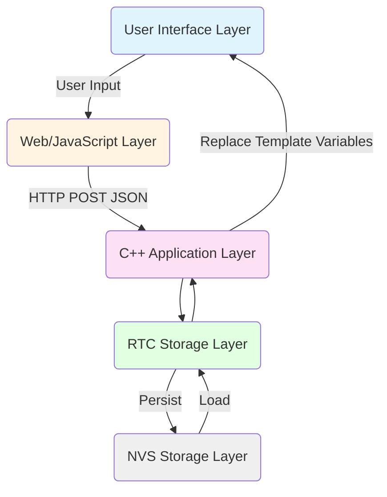
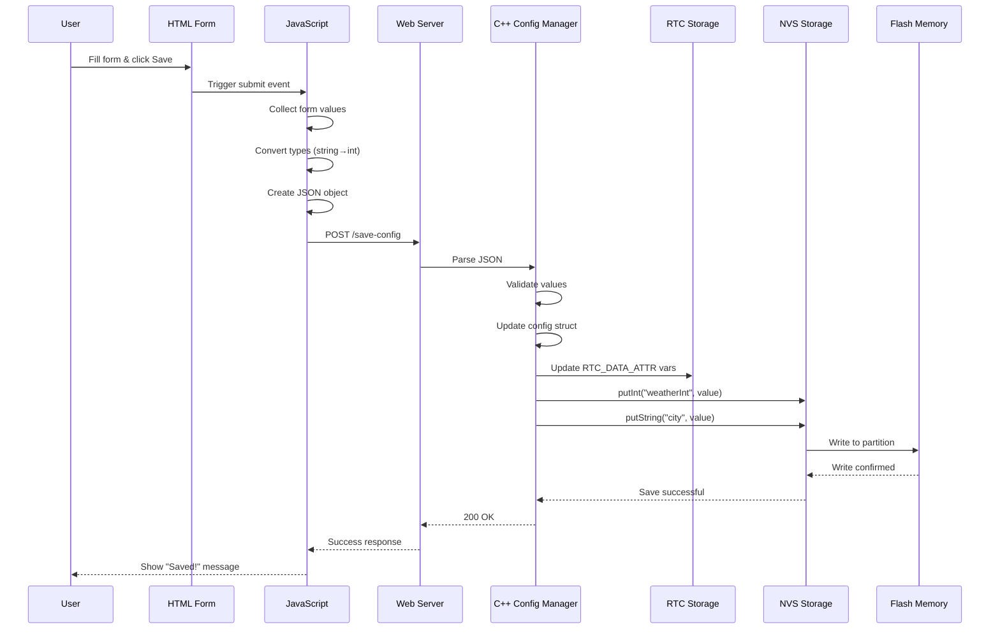
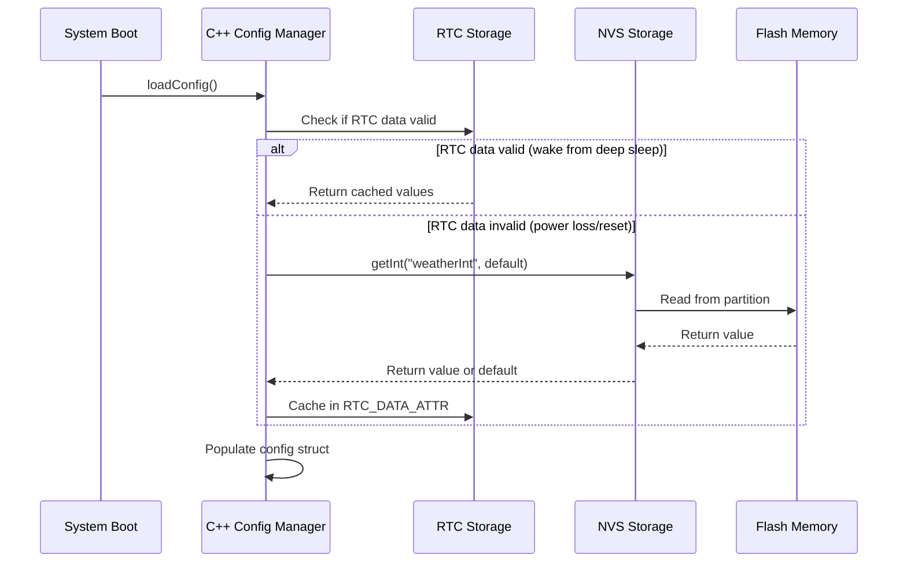
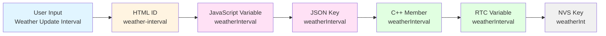

# Configuration Architecture

## Why Multiple Configuration Layers?

MyStation's configuration system spans multiple layers of the application stack, each serving a specific purpose.
Understanding why this complexity exists is crucial for maintaining and extending the system.

## The Five-Layer Architecture



_RTC Storage Layer_ refers to RTC_DATA_ATTR variables for fast access after deep sleep.
RTC_DATA_ATTR variables are preverved across deep sleep cycles but lost on full power loss or pushing reset button.

_NVS Storage Layer_ refers to ESP32's Non-Volatile Storage for persistent configuration.
After Power loss/pushing reset button, data in NVS remains intact.

### Layer 1: HTML/UI Layer (User Interface)

**Purpose**: Present configuration options to the user

**Technology**: HTML form elements with IDs

**Example**:

```html
<input type="number" id="weather-interval" value="{{WEATHER_INTERVAL}}">
<input type="text" id="city-display" value="{{CITY_NAME}}">
```

**Why This Layer?**

- **User-Friendly**: Provides human-readable labels and input controls
- **Validation**: Browser-native input validation (min/max, required, etc.)
- **Accessibility**: Standard HTML forms work with screen readers and assistive devices
- **Template System**: Mustache-style `{{VARIABLES}}` allow dynamic content injection

**Naming Convention**: `kebab-case` (e.g., `weather-interval`, `city-display`)

---

### Layer 2: JavaScript/JSON Layer (Data Transport)

**Purpose**: Collect form data and transmit to server

**Technology**: JavaScript objects and JSON serialization

**Example**:

```javascript
var weatherInterval = document.getElementById('weather-interval').value;
var config = {
    weatherInterval: parseInt(weatherInterval),
    cityName: document.getElementById('city-display').value
};

fetch('/save-config', {
    method: 'POST',
    body: JSON.stringify(config)
});
```

**Why This Layer?**

- **Type Conversion**: Convert string inputs to proper types (int, float, bool)
- **Validation**: Client-side validation before sending to server
- **Structured Data**: JSON provides clear, type-safe data structure
- **Debugging**: Easy to inspect network traffic and payloads
- **Standard Protocol**: HTTP POST with JSON is universal and well-understood

**Naming Convention**: `camelCase` (e.g., `weatherInterval`, `cityName`)

---

### Layer 3: C++ Application Layer (Business Logic)

**Purpose**: Process configuration, apply defaults, validate ranges

**Technology**: C++ struct with member variables

**Example**:

```cpp
struct StationConfig {
    int weatherInterval = 60;      // Default: 60 minutes
    char cityName[32] = "Frankfurt";  // Default city
    float latitude = 50.1109;
    float longitude = 8.6821;

    // ... other fields
};
```

**Why This Layer?**

- **Type Safety**: Strong typing prevents errors
- **Default Values**: Compile-time defaults ensure system always has valid config
- **Memory Management**: Fixed-size arrays prevent overflow
- **Performance**: Direct memory access, no parsing overhead
- **Validation**: Range checks and business logic validation
- **Cross-Module Access**: Other C++ modules can directly access configuration

**Naming Convention**: `camelCase` (e.g., `weatherInterval`, `cityName`)

---

### Layer 4: RTC Storage Layer (Persistence)

**Purpose**: Store configuration RTC Memory for fast access after deep sleep

**Technology**: ESP32 RTC Memory

**Why This Layer?**

- **Persistence**: Survives deep sleep
- **Key-Value Store**: Simple, efficient storage mechanism

**Naming Convention**: Abbreviated (≤15 chars) due to NVS limitations

- Examples: `weatherInt`, `city`, `stopId`, `transStart`

**Why Abbreviated?**

- **NVS Limitation**: Keys limited to 15 characters maximum
- **Flash Efficiency**: Shorter keys = less flash usage
- **Performance**: Faster key lookups with shorter strings

---

### Layer 5: Flash Memory (Hardware)

**Purpose**: Physical storage of configuration data

**Technology**: SPI Flash with wear leveling

**Why This Layer?**

- **Non-Volatile**: Data persists when power is removed
- **Wear Leveling**: NVS library manages flash cell wear automatically
- **Partition Isolation**: Configuration stored in dedicated NVS partition
- **Backup**: Can implement backup/restore mechanisms

---

## Data Flow: User to Flash

### Save Configuration Flow



### Load Configuration Flow



---

## Key Naming Mapping Strategy

### The Transformation Path



### Naming Rules

| Layer           | Convention  | Reason                   | Example            |
|-----------------|-------------|--------------------------|--------------------|
| HTML (Layer 1)  | kebab-case  | HTML/CSS standard        | `weather-interval` |
| JavaScript (L2) | camelCase   | JavaScript convention    | `weatherInterval`  |
| JSON (L2)       | camelCase   | JSON/REST API standard   | `weatherInterval`  |
| C++ (Layer 3)   | camelCase   | C++ convention (members) | `weatherInterval`  |
| RTC (Layer 4)   | camelCase   | C++ convention           | `weatherInterval`  |
| NVS (Layer 5)   | Abbreviated | 15-char limit            | `weatherInt`       |

### Consistency Benefits

- **Predictable**: Developers can guess key names
- **Maintainable**: Easy to trace through layers
- **Debuggable**: Can search for variations of same name
- **Documented**: Clear mapping tables exist

---

## Special Cases

### RTC Storage Layer (Layer 4): Fast Access After Deep Sleep

**Purpose**: Provide ultra-fast access to configuration data after deep sleep wake, avoiding slow NVS reads

**Technology**: RTC_DATA_ATTR variables stored in RTC RAM

**Example**:

```cpp
// Configuration cached in RTC RAM
RTC_DATA_ATTR int rtc_weatherInterval = 60;
RTC_DATA_ATTR char rtc_cityName[32] = "";
RTC_DATA_ATTR bool rtc_configValid = false;

// Load strategy
void ConfigManager::loadConfig() {
    if (rtc_configValid) {
        // Fast path: Use RTC cached values after deep sleep wake
        g_stationConfig.weatherInterval = rtc_weatherInterval;
        strcpy(g_stationConfig.cityName, rtc_cityName);
    } else {
        // Slow path: Load from NVS after power loss/reset
        g_stationConfig.weatherInterval = preferences.getInt("weatherInt", 60);
        preferences.getString("city", g_stationConfig.cityName, sizeof(g_stationConfig.cityName));

        // Cache in RTC for next wake
        rtc_weatherInterval = g_stationConfig.weatherInterval;
        strcpy(rtc_cityName, g_stationConfig.cityName);
        rtc_configValid = true;
    }
}
```

**Why This Layer?**

- **Performance**: RTC RAM access is ~100x faster than NVS flash reads
- **Battery Life**: Reduces flash access, saving power on each wake cycle
- **Deep Sleep Support**: Data persists across deep sleep cycles
- **No Flash Wear**: Avoids unnecessary flash write cycles

**When RTC Data is Valid**:

- ✅ After deep sleep wake (most common case)
- ✅ During normal operation between sleeps

**When RTC Data is Invalid**:

- ❌ After power loss (battery removed/dead)
- ❌ After pressing reset button
- ❌ After firmware upload
- ❌ First boot ever

**Trade-offs**:

- **Limited Lifetime**: Lost on full power loss (unlike NVS/Flash)
- **Small Size**: RTC RAM is limited (8KB on ESP32)
- **No Persistence**: Not suitable for long-term storage

**Best Practices**:

- Always check validity flag before using RTC data
- Always have NVS as fallback
- Cache frequently-accessed config in RTC
- Don't store sensitive data in RTC (not encrypted)

---

## Performance Considerations

### Access Speed Comparison

| Storage Type   | Read Speed | Survives Deep Sleep | Survives Power Loss |
|----------------|------------|---------------------|---------------------|
| C++ RAM        | Fastest    | ❌ No                | ❌ No                |
| RTC RAM (L4)   | Very Fast  | ✅ Yes               | ❌ No                |
| NVS Flash (L5) | Slow       | ✅ Yes               | ✅ Yes               |

### NVS Access Best Practices

**Fast Operations**:

- ✅ Reading all config at boot (once)
- ✅ Bulk save operation (all fields at once)
- ✅ Using RTC cache for frequent reads

**Slow Operations**:

- ❌ Reading NVS every wake cycle (use RTC instead)
- ❌ Saving single field repeatedly
- ❌ Loading config multiple times per wake

### Typical Performance Numbers

| Operation                  | Time    | Note                         |
|----------------------------|---------|------------------------------|
| Load from RTC (deep sleep) | ~1 ms   | Fast path, most common       |
| Load from NVS (power loss) | ~50 ms  | Slow path, infrequent        |
| Save to NVS + RTC          | ~100 ms | One-time cost on config save |
| Deep sleep wake (with RTC) | ~200 ms | Includes WiFi reconnect      |
| Cold boot (without RTC)    | ~250 ms | Includes NVS read + WiFi     |

---

## Summary

### Why This Complexity?

The five-layer architecture exists because:

1. **Separation of Concerns**: Each layer has one job
2. **Type Safety**: Strong typing prevents errors
3. **Validation**: Multiple validation points
4. **Persistence**: Survives power loss
5. **Performance**: Optimized for embedded systems with RTC caching
6. **Maintainability**: Clear boundaries, easy to debug
7. **Extensibility**: Easy to add new fields
8. **Migration**: Can evolve configuration format
9. **Battery Efficiency**: RTC layer minimizes flash access

### Key Principle

> **Data flows through transformations, each layer adding value**

- **Layer 1 - HTML**: User interaction and presentation
- **Layer 2 - JavaScript/JSON**: Client-side logic and transport format
- **Layer 3 - C++ Application**: Business logic, validation, and runtime access
- **Layer 4 - RTC Storage**: Fast access cache for deep sleep scenarios
- **Layer 5 - NVS Storage**: Persistent storage surviving power loss

### The Smart Loading Strategy

```
Power-On/Reset:  NVS (slow) → C++ → RTC → Display
                  └─────────────────────┘
                  Cache for future wakes

Deep Sleep Wake: RTC (fast) → C++ → Display
                  └─────────────────┘
                  Skip NVS entirely
```

This architecture has served MyStation well and should be maintained as the project evolves.

