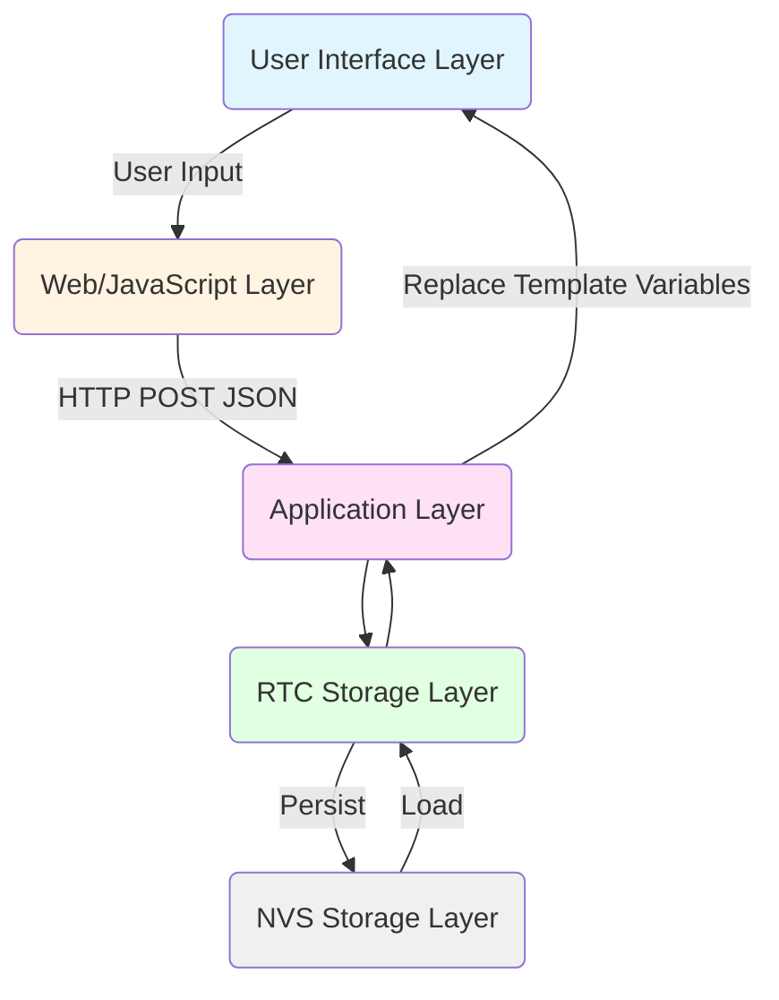
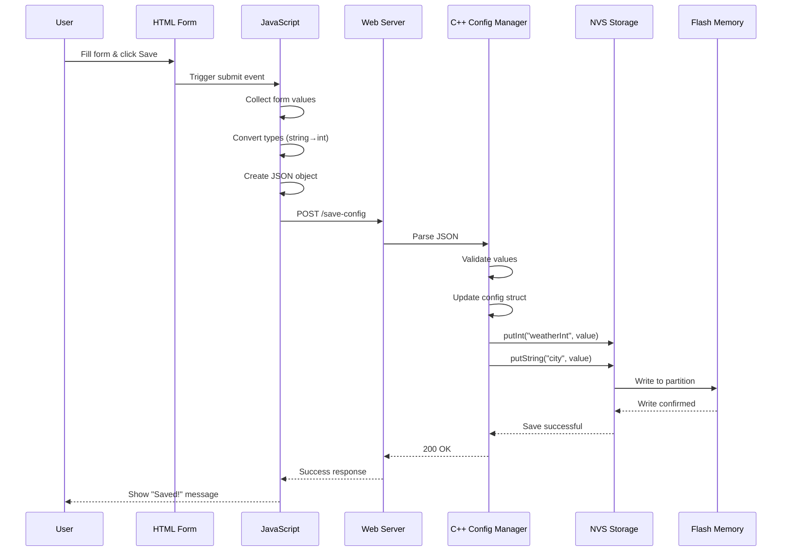
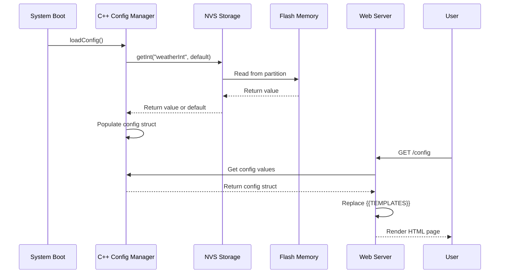
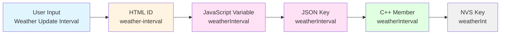

# Configuration Architecture

## Why Multiple Configuration Layers?

MyStation's configuration system spans multiple layers of the application stack, each serving a specific purpose.
Understanding why this complexity exists is crucial for maintaining and extending the system.

## The Five-Layer Architecture



_RTC Storage Layer_ refers to RTC_DATA_ATTR variables for fast access after deep sleep.
RTC_DATA_ATTR variables are preverved across deep sleep cycles but lost on full power loss or pushing reset button.

_NVS Storage Layer_ refers to ESP32's Non-Volatile Storage for persistent configuration.
After Power loss/pushing reset button, data in NVS remains intact.

### Layer 1: HTML/UI Layer (User Interface)

**Purpose**: Present configuration options to the user

**Technology**: HTML form elements with IDs

**Example**:

```html
<input type="number" id="weather-interval" value="{{WEATHER_INTERVAL}}">
<input type="text" id="city-display" value="{{CITY_NAME}}">
```

**Why This Layer?**

- **User-Friendly**: Provides human-readable labels and input controls
- **Validation**: Browser-native input validation (min/max, required, etc.)
- **Accessibility**: Standard HTML forms work with screen readers and assistive devices
- **Template System**: Mustache-style `{{VARIABLES}}` allow dynamic content injection

**Naming Convention**: `kebab-case` (e.g., `weather-interval`, `city-display`)

---

### Layer 2: JavaScript/JSON Layer (Data Transport)

**Purpose**: Collect form data and transmit to server

**Technology**: JavaScript objects and JSON serialization

**Example**:

```javascript
var weatherInterval = document.getElementById('weather-interval').value;
var config = {
    weatherInterval: parseInt(weatherInterval),
    cityName: document.getElementById('city-display').value
};

fetch('/save-config', {
    method: 'POST',
    body: JSON.stringify(config)
});
```

**Why This Layer?**

- **Type Conversion**: Convert string inputs to proper types (int, float, bool)
- **Validation**: Client-side validation before sending to server
- **Structured Data**: JSON provides clear, type-safe data structure
- **Debugging**: Easy to inspect network traffic and payloads
- **Standard Protocol**: HTTP POST with JSON is universal and well-understood

**Naming Convention**: `camelCase` (e.g., `weatherInterval`, `cityName`)

---

### Layer 3: C++ Application Layer (Business Logic)

**Purpose**: Process configuration, apply defaults, validate ranges

**Technology**: C++ struct with member variables

**Example**:

```cpp
struct StationConfig {
    int weatherInterval = 60;      // Default: 60 minutes
    char cityName[32] = "Frankfurt";  // Default city
    float latitude = 50.1109;
    float longitude = 8.6821;

    // ... other fields
};
```

**Why This Layer?**

- **Type Safety**: Strong typing prevents errors
- **Default Values**: Compile-time defaults ensure system always has valid config
- **Memory Management**: Fixed-size arrays prevent overflow
- **Performance**: Direct memory access, no parsing overhead
- **Validation**: Range checks and business logic validation
- **Cross-Module Access**: Other C++ modules can directly access configuration

**Naming Convention**: `camelCase` (e.g., `weatherInterval`, `cityName`)

---

### Layer 4: NVS Storage Layer (Persistence)

**Purpose**: Store configuration in non-volatile flash memory

**Technology**: ESP32 NVS (Non-Volatile Storage) API

**Example**:

```cpp
// Save
preferences.putInt("weatherInt", config.weatherInterval);
preferences.putString("city", config.cityName);

// Load
config.weatherInterval = preferences.getInt("weatherInt", 60);
preferences.getString("city", config.cityName, sizeof(config.cityName));
```

**Why This Layer?**

- **Persistence**: Survives power loss, reboots, firmware updates
- **Key-Value Store**: Simple, efficient storage mechanism
- **Atomic Operations**: NVS handles flash write cycles and wear leveling
- **Separate Namespace**: Can isolate WiFi credentials in encrypted namespace
- **Version Migration**: Can detect and migrate old configuration formats

**Naming Convention**: Abbreviated (≤15 chars) due to NVS limitations

- Examples: `weatherInt`, `city`, `stopId`, `transStart`

**Why Abbreviated?**

- **NVS Limitation**: Keys limited to 15 characters maximum
- **Flash Efficiency**: Shorter keys = less flash usage
- **Performance**: Faster key lookups with shorter strings

---

### Layer 5: Flash Memory (Hardware)

**Purpose**: Physical storage of configuration data

**Technology**: SPI Flash with wear leveling

**Why This Layer?**

- **Non-Volatile**: Data persists when power is removed
- **Wear Leveling**: NVS library manages flash cell wear automatically
- **Partition Isolation**: Configuration stored in dedicated NVS partition
- **Backup**: Can implement backup/restore mechanisms

---

## Data Flow: User to Flash

### Save Configuration Flow



### Load Configuration Flow



---

## Key Naming Mapping Strategy

### The Transformation Path



### Naming Rules

| Layer      | Convention  | Reason                   | Example            |
|------------|-------------|--------------------------|--------------------|
| HTML       | kebab-case  | HTML/CSS standard        | `weather-interval` |
| JavaScript | camelCase   | JavaScript convention    | `weatherInterval`  |
| JSON       | camelCase   | JSON/REST API standard   | `weatherInterval`  |
| C++        | camelCase   | C++ convention (members) | `weatherInterval`  |
| NVS        | Abbreviated | 15-char limit            | `weatherInt`       |

### Consistency Benefits

- **Predictable**: Developers can guess key names
- **Maintainable**: Easy to trace through layers
- **Debuggable**: Can search for variations of same name
- **Documented**: Clear mapping tables exist

---

## Special Cases

### 3. RTC Memory (Ultra-Fast Access)

**Problem**: Some data needed immediately after deep sleep wake

**Solution**: Store critical data in RTC RAM

```cpp
RTC_DATA_ATTR int wakeupCount = 0;
RTC_DATA_ATTR DisplayMode temporaryMode = DISPLAY_MODE_NONE;
```

**Why**:

- RTC RAM survives deep sleep
- Faster access than NVS
- No flash wear from frequent writes

**Trade-off**: Lost on full power loss (not just deep sleep)

---

## Performance Considerations

### NVS Access Patterns

**Fast**:

- ✅ Reading config at boot (once)
- ✅ Bulk save operation (all fields at once)

**Slow**:

- ❌ Reading every wake cycle
- ❌ Saving single field repeatedly

**Optimization**: Load once to RAM, save in batches

```cpp
// GOOD: Load once
void setup() {
    ConfigManager::loadConfig();  // Loads everything once
    // ... use g_stationConfig throughout
}

// BAD: Load every time
void loop() {
    int interval = preferences.getInt("weatherInt", 60);  // Don't do this!
}
```

---

## Summary

### Why This Complexity?

The five-layer architecture exists because:

1. **Separation of Concerns**: Each layer has one job
2. **Type Safety**: Strong typing prevents errors
3. **Validation**: Multiple validation points
4. **Persistence**: Survives power loss
5. **Performance**: Optimized for embedded systems
6. **Maintainability**: Clear boundaries, easy to debug
7. **Extensibility**: Easy to add new fields
8. **Migration**: Can evolve configuration format

### Key Principle

> **Data flows through transformations, each layer adding value**

- HTML: User interaction
- JavaScript: Client-side logic
- JSON: Transport format
- C++: Business logic and validation
- NVS: Persistence
- Flash: Physical storage

This architecture has served MyStation well and should be maintained as the project evolves.

---

## Related Documentation

- [Configuration Keys Reference](../../reference/configuration-keys-quick-reference.md)
- [Configuration Data Flow](../configuration-data-flow.md)
- [Boot Process](boot-process.md)
- [Development Setup](development-setup.md)

