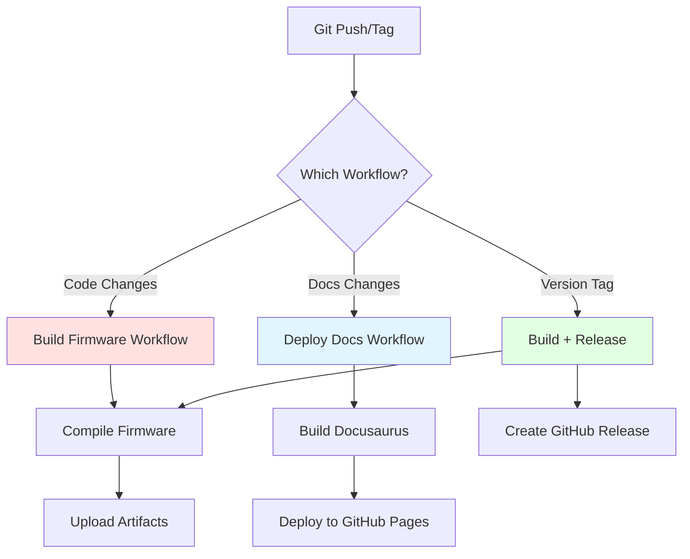
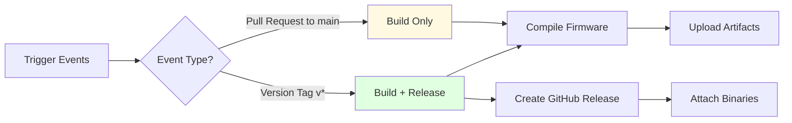
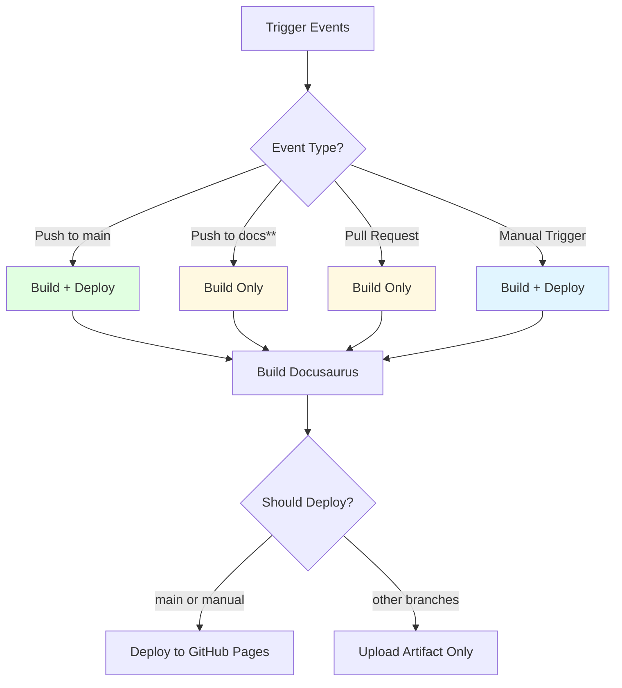

# GitHub Actions CI/CD Guide

This guide explains the automated workflows configured for the MyStation project using GitHub Actions.

## Overview

MyStation uses **two GitHub Actions workflows** for continuous integration and deployment:

1. **Build and Release Firmware** - Compiles ESP32 firmware and creates releases
2. **Deploy Documentation** - Builds and deploys Docusaurus documentation to GitHub Pages



---

## Workflow 1: Build and Release Firmware

**File**: `.github/workflows/build-firmware.yml`

### Purpose

Automatically builds ESP32 firmware whenever code changes are pushed or a new version is tagged. Creates GitHub Releases
for tagged versions.

### When It Runs



**Trigger Conditions**:

- **Pull Requests** to `main` branch → Build and test
- **Tags** matching `v*` pattern (e.g., `v1.0.0`, `v2.1.3`) → Build and release

**Example**:

```bash
# This triggers build only (PR)
git checkout -b feature/new-display-mode
git commit -m "Add new display mode"
git push origin feature/new-display-mode
# → Open PR → GitHub Actions builds firmware

# This triggers build + release
git tag v1.2.0
git push origin v1.2.0
# → GitHub Actions builds AND creates release
```

### What It Does

#### Job 1: Build

**Environment**: Ubuntu Latest
**Matrix Strategy**: Builds for `esp32-c3-production` environment

**Steps**:

1. **Checkout Code**
   ```yaml
   - uses: actions/checkout@v4
   ```
   Clones the repository to the GitHub Actions runner.

2. **Cache Dependencies**
   ```yaml
   - uses: actions/cache@v4
   ```
   Caches PlatformIO packages and Python pip to speed up builds.
    - Cached items: `~/.cache/pip`, `~/.platformio/.cache`, `~/.platformio/packages`
    - Cache key: OS-specific (e.g., `Linux-pio`)

3. **Setup Python**
   ```yaml
   - uses: actions/setup-python@v5
     with:
       python-version: '3.11'
   ```
   Installs Python 3.11 for PlatformIO.

4. **Install PlatformIO**
   ```bash
   pip install --upgrade platformio==6.1.18
   ```
   Installs specific PlatformIO version for consistency.

5. **Create Secrets Files**
   ```bash
   cat > src/secrets/general_secrets.h << EOF
   #define GOOGLE_API_KEY "${{ secrets.GOOGLE_API_KEY }}"
   #define ENCRYPTION_KEY "${{ secrets.ENCRYPTION_KEY }}"
   #define RMV_API_KEY "${{ secrets.RMV_API_KEY }}"
   EOF
   ```

   **Important**: This step creates the secrets header file from GitHub Secrets.

   **Required Secrets** (configure in GitHub Settings → Secrets):
    - `GOOGLE_API_KEY` - Google Geolocation API key
    - `ENCRYPTION_KEY` - AES encryption key for secure storage
    - `RMV_API_KEY` - RMV public transport API key
    - `ACTION_TOKEN` - GitHub Personal Access Token for releases

6. **Build Firmware**
   ```bash
   pio run -e esp32-c3-production
   ```
   Compiles firmware for ESP32-C3 production environment.

   **Output Files**:
    - `.pio/build/esp32-c3-production/firmware.bin` - Main firmware
    - `.pio/build/esp32-c3-production/bootloader.bin` - Bootloader
    - `.pio/build/esp32-c3-production/partitions.bin` - Partition table
    - `.pio/build/esp32-c3-production/firmware.elf` - Debug symbols

7. **Create Build Info**
   ```bash
   echo "Commit: ${{ github.sha }}" >> build_info.txt
   echo "Branch: ${{ github.ref_name }}" >> build_info.txt
   ```
   Generates metadata file with build information.

8. **Upload Artifacts**
   ```yaml
   - uses: actions/upload-artifact@v4
   ```
   Uploads compiled binaries as workflow artifacts.
    - **Retention**: 30 days
    - **Includes**: All `.bin` files, `firmware.elf`, `build_info.txt`

#### Job 2: Release

**Depends On**: `build` job
**Condition**: Only runs when a version tag is pushed (`if: github.ref_type == 'tag'`)

**Steps**:

1. **Download Artifacts**
   ```yaml
   - uses: actions/download-artifact@v5
   ```
   Downloads all build artifacts from the build job.

2. **Create Release Package**
    - Copies firmware binaries to `release/` directory
    - Creates `FLASHING_INSTRUCTIONS.md` with detailed flashing guide
    - Generates `VERSION.txt` with version information
    - Creates ZIP package: `mystation-firmware-{commit}.zip`

3. **Create GitHub Release**
   ```yaml
   - uses: softprops/action-gh-release@v2
   ```

   Creates a new GitHub Release with:
    - **Name**: `MyStation E-Board v1.2.0`
    - **Tag**: Version tag (e.g., `v1.2.0`)
    - **Files**: All binaries, instructions, and package
    - **Body**: Auto-generated release notes with:
        - What's new
        - Files included
        - Quick flash command
        - Documentation links

### Artifacts Produced

```
mystation-firmware-{sha}/
├── firmware.bin              # Main application binary
├── bootloader.bin            # ESP32 bootloader
├── partitions.bin            # Partition table
├── firmware.elf              # Debug symbols (for crash analysis)
├── littlefs.bin             # Web interface filesystem
├── build_info.txt           # Build metadata
├── config_my_station.html   # Configuration web page
├── FLASHING_INSTRUCTIONS.md # User guide
└── VERSION.txt              # Version information
```

### Configuration

**PlatformIO Default Environment**: `esp32-s3-production`

---

## Workflow 2: Deploy Documentation

**File**: `.github/workflows/deploy-docs.yml`

### Purpose

Automatically builds and deploys the Docusaurus documentation website to GitHub Pages whenever documentation files are
updated.

### When It Runs



**Trigger Conditions**:

- **Push** to `main` branch → Build and deploy
- **Push** to branches starting with `docs` (e.g., `docs-update`, `docs/feature`) → Build only (preview)
- **Pull Request** to `main` → Build only (verify)
- **Manual Trigger** (`workflow_dispatch`) → Build and deploy

**Paths Watched**:

- `docs/**` - Documentation content
- `website/**` - Docusaurus configuration and theme
- `.github/workflows/deploy-docs.yml` - The workflow itself

**Example**:

```bash
# Triggers build + deploy (main branch)
git checkout main
git commit -m "Update user guide"
git push origin main
# → Builds and deploys to GitHub Pages

# Triggers build only (docs branch)
git checkout -b docs-new-feature
git commit -m "Add new feature documentation"
git push origin docs-new-feature
# → Builds but doesn't deploy (preview only)

# Manual trigger (from GitHub UI)
# Go to Actions → Deploy Documentation → Run workflow
# → Builds and deploys regardless of branch
```

### What It Does

#### Job 1: Build

**Environment**: Ubuntu Latest
**Node.js Version**: 22 (Latest LTS)

**Steps**:

1. **Checkout Repository**
   ```yaml
   - uses: actions/checkout@v5
   ```
   Clones the repository with documentation files.

2. **Setup Node.js**
   ```yaml
   - uses: actions/setup-node@v6
     with:
       node-version: '22'
   ```
   Installs Node.js 22 LTS for Docusaurus.

3. **Install Dependencies**
   ```bash
   cd website
   npm install
   ```
   Installs all npm packages from `website/package.json`:
    - `@docusaurus/core`
    - `@docusaurus/preset-classic`
    - Theme packages
    - Plugins (Mermaid, etc.)

4. **Build Docusaurus Site**
   ```bash
   npm run build
   ```

   Runs Docusaurus production build:
    - Processes all markdown files
    - Renders Mermaid diagrams
    - Generates static HTML
    - Optimizes assets (JS, CSS)
    - Creates search index

   **Output**: `website/build/` directory with complete static site

5. **Upload Artifact**
   ```yaml
   - uses: actions/upload-pages-artifact@v3
     with:
       path: ./website/build
   ```
   Uploads the built site for deployment.

#### Job 2: Deploy

**Depends On**: `build` job
**Environment**: `github-pages` (special GitHub environment)
**Condition**: Only deploys from `main` branch or manual trigger

**Permissions Required**:

```yaml
permissions:
    contents: read      # Read repository
    pages: write        # Write to GitHub Pages
    id-token: write     # Verify identity
```

**Steps**:

1. **Deploy to GitHub Pages**
   ```yaml
   - uses: actions/deploy-pages@v4
   ```

   Deploys the built site to GitHub Pages:
    - Publishes to `https://{username}.github.io/{repo}/`
    - Updates the live documentation site
    - Returns the deployment URL

### Concurrency Control

```yaml
concurrency:
    group: "pages"
    cancel-in-progress: false
```

**Purpose**: Prevents multiple deployments from running simultaneously.

- Only one deployment can run at a time
- New deployments wait for current one to finish (no cancellation)
- Ensures stable, consistent deployments

### Deployment URL

After successful deployment, documentation is available at:

```
https://gogo-boot.github.io/e-board/
```

**Structure**:

- `/` - Homepage
- `/docs/user-guide/quick-start` - User documentation
- `/docs/developer-guide/index` - Developer documentation
- `/docs/reference/configuration-keys-quick-reference` - Quick references

---

## Setting Up GitHub Actions

### Required Repository Secrets

Navigate to: **Settings → Secrets and variables → Actions → New repository secret**

| Secret Name      | Description                            | Example                            |
|------------------|----------------------------------------|------------------------------------|
| `GOOGLE_API_KEY` | Encrypted Google Geolocation API key   | `AIzaSyC...`                       |
| `ENCRYPTION_KEY` | 32-character AES encryption key        | `your-32-char-encryption-key-here` |
| `RMV_API_KEY`    | Encrypted RMV public transport API key | `your-rmv-api-key`                 |
| `ACTION_TOKEN`   | GitHub Personal Access Token (classic) | `ghp_...`                          |

**Creating ACTION_TOKEN**:

1. Go to GitHub Settings → Developer settings → Personal access tokens
2. Generate new token (classic)
3. Select scopes: `repo` (full repository access)
4. Copy token and add as secret

### Enabling GitHub Pages

1. Go to **Settings → Pages**
2. **Source**: GitHub Actions
3. No additional configuration needed (workflow handles deployment)

---

## Manual Workflow Triggers

### Triggering Documentation Deployment

**Via GitHub UI**:

1. Go to **Actions** tab
2. Select "Deploy Docusaurus Documentation"
3. Click **Run workflow**
4. Select branch (usually `main`)
5. Click **Run workflow** button

**Via GitHub CLI**:

```bash
gh workflow run deploy-docs.yml
```

**Use Case**: Force documentation update without code changes

### Creating a Release

**Via Git Tag**:

```bash
# Create and push tag
git tag v1.0.0
git push origin v1.0.0

# Or create annotated tag
git tag -a v1.0.0 -m "Release version 1.0.0"
git push origin v1.0.0
```

**Via GitHub UI**:

1. Go to **Releases** tab
2. Click **Draft a new release**
3. Create new tag (e.g., `v1.0.0`)
4. Click **Publish release**
5. Workflow automatically triggered

---

## Cost and Usage Limits

### GitHub Actions Limits

**Free Tier** (Public Repositories):

- ✅ Unlimited minutes
- ✅ Unlimited storage (artifacts expire after 90 days max)

**Private Repositories**:

- 2,000 minutes/month (Free tier)
- 500 MB storage for artifacts

### Optimization Tips

1. **Use caching** - Reduces build time and bandwidth
2. **Clean up old artifacts** - Set appropriate retention days
3. **Cancel redundant runs** - Push force updates cancel old runs
4. **Use matrix builds** - Parallel execution is free

---

## Summary

### Build Firmware Workflow

- **Triggers**: Pull requests, version tags
- **Duration**: ~2 minutes (cached)
- **Output**: Compiled binaries + GitHub Release
- **Purpose**: Automated firmware compilation and distribution

### Deploy Docs Workflow

- **Triggers**: Pushes to main/docs branches, manual
- **Duration**: ~1 minute (cached)
- **Output**: Live documentation website
- **Purpose**: Automated documentation deployment

Both workflows ensure:

- ✅ Consistent builds across environments
- ✅ Automated testing and deployment
- ✅ Version tracking and artifacts
- ✅ Reduced manual errors

---

## Related Documentation

- [Development Setup](development-setup.md) - Local build instructions
- [Configuration Layers](configuration-layers.md) - How configuration works
- [Testing](testing.md) - Running tests locally
- [Run Book](run-book.md) - Operational procedures and troubleshooting

