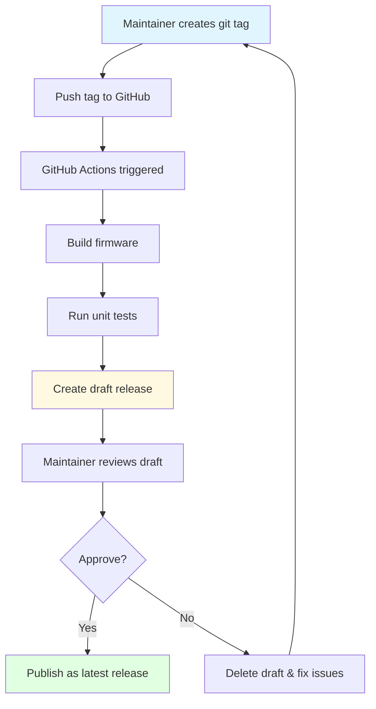

# Release Process

This guide explains how to create a new firmware release for the MyStation project.

## Overview

The release process follows these steps:



## Prerequisites

Before creating a release, ensure:

- [ ] All features for this release are merged to `main` branch
- [ ] All tests pass locally (`pio test -e native`)
- [ ] The firmware builds successfully (`pio run`)
- [ ] You have reviewed the changes since the last release

## Step 1: Create a Git Tag

### Version Format

The project follows [Semantic Versioning](https://semver.org/) with a `v` prefix:

```
v<MAJOR>.<MINOR>.<PATCH>
```

| Version Part | When to Increment                      | Example             |
|--------------|----------------------------------------|---------------------|
| **MAJOR**    | Breaking changes or major new features | `v1.0.0` → `v2.0.0` |
| **MINOR**    | New features, backward compatible      | `v1.0.0` → `v1.1.0` |
| **PATCH**    | Bug fixes, backward compatible         | `v1.0.0` → `v1.0.1` |

### Examples

```
v1.0.0    # Initial stable release
v1.0.1    # Bug fix release
v1.1.0    # New feature release
v2.0.0    # Major release with breaking changes
v1.2.0-beta.1  # Pre-release (optional)
```

### Create the Tag

1. **Ensure you're on the latest `main` branch:**

   ```bash
   git checkout main
   git pull origin main
   ```

2. **Check the current version:**

   ```bash
   git describe --tags --abbrev=0
   # Output: v1.0.0 (example)
   ```

3. **Create an annotated tag:**

   ```bash
   # For a patch release (bug fixes)
   git tag -a v1.0.1 -m "Release v1.0.1: Bug fixes and improvements"

   # For a minor release (new features)
   git tag -a v1.1.0 -m "Release v1.1.0: Add new display mode"

   # For a major release (breaking changes)
   git tag -a v2.0.0 -m "Release v2.0.0: Major architecture update"
   ```

   > **Note:** Use annotated tags (`-a`) instead of lightweight tags. Annotated tags store extra metadata including the
   tagger name, email, date, and message.

4. **Verify the tag was created:**

   ```bash
   git tag -l "v*" --sort=-v:refname | head -5
   ```

## Step 2: Push the Tag to GitHub

Push the tag to trigger the GitHub Actions workflow:

```bash
git push origin v1.0.1
```

Or push all tags:

```bash
git push origin --tags
```

> **Important:** Only push the tag when you're ready to create a release. Once pushed, the GitHub Actions workflow will
> start automatically.

## Step 3: Monitor the GitHub Actions Workflow

1. Go to the repository on GitHub
2. Navigate to **Actions** tab
3. Find the workflow run triggered by your tag push
4. Monitor the build progress:
    - **Build job**: Compiles firmware and runs tests
    - **Release job**: Creates the draft release (only runs if build succeeds)

### If the Build Fails

1. Check the workflow logs for errors
2. Fix the issues in a new commit
3. Delete the failed tag:
   ```bash
   # Delete local tag
   git tag -d v1.0.1

   # Delete remote tag
   git push origin :refs/tags/v1.0.1
   ```
4. Delete the draft release on GitHub (if created)
5. Start over from Step 1

## Step 4: Review the Draft Release

Once the GitHub Actions workflow completes successfully, a **draft release** is created.

1. Go to the repository on GitHub
2. Navigate to **Releases** (right sidebar or Code → Releases)
3. Find the draft release (marked with "Draft" label)

### What to Review

- [ ] **Release title**: Should be `MyStation v1.0.1`
- [ ] **Release notes**: Auto-generated from commit messages
- [ ] **Attached files**:
    - `firmware.bin` - Main firmware binary
    - `bootloader.bin` - ESP32 bootloader
    - `partitions.bin` - Partition table
    - `firmware.elf` - Debug symbols
    - `build_info.txt` - Build metadata
    - `config_my_station.html` - Configuration page
    - `VERSION.txt` - Version information
    - `mystation-firmware-{sha}.zip` - Complete package

### Edit Release Notes (Optional)

Click **Edit** on the draft release to:

- Add a summary of changes
- Highlight breaking changes
- Add upgrade instructions
- Include known issues
- Add acknowledgments

**Recommended Release Notes Template:**

```markdown
## What's Changed

### New Features

- Feature 1 description
- Feature 2 description

### Bug Fixes

- Fix 1 description
- Fix 2 description

### Breaking Changes

- Change 1 (if any)

## Upgrade Instructions

1. Download `firmware.bin`
2. Flash using web interface or USB

## Full Changelog

https://github.com/gogo-boot/mystation/compare/v1.0.0...v1.0.1
```

## Step 5: Publish the Release

After reviewing the draft release:

1. Click **Edit** on the draft release (if not already editing)
2. Scroll to the bottom
3. Ensure **Set as the latest release** is checked
4. Click **Publish release**

The release is now public and will be:

- Listed on the Releases page
- Available for OTA updates (devices check the latest release)
- Visible to users and contributors

## Quick Reference

### Command Summary

```bash
# Check current version
git describe --tags --abbrev=0

# Create new tag
git tag -a v1.0.1 -m "Release v1.0.1: Description"

# Push tag to trigger release
git push origin v1.0.1

# Delete tag (if needed)
git tag -d v1.0.1                    # local
git push origin :refs/tags/v1.0.1   # remote
```

### Release Checklist

- [ ] All changes merged to `main`
- [ ] Tests pass locally
- [ ] Version number follows semver
- [ ] Tag created with `-a` flag and descriptive message
- [ ] Tag pushed to GitHub
- [ ] GitHub Actions build successful
- [ ] Draft release reviewed
- [ ] Release notes edited (if needed)
- [ ] Release published

## Related Documentation

- [GitHub Actions CI/CD Guide](github-actions.md) - Details on the build workflow
- [OTA Update](ota-update.md) - How devices receive updates
- [Certificate Bundle](certificate-bundle.md) - HTTPS certificates for OTA

## Troubleshooting

### Tag Already Exists

If you accidentally created a tag with the wrong name:

```bash
# Delete and recreate
git tag -d v1.0.1
git tag -a v1.0.1 -m "Correct message"
```

### Workflow Not Triggered

Ensure your tag follows the `v*` pattern:

- ✅ `v1.0.0`, `v1.0.1`, `v2.0.0-beta.1`
- ❌ `1.0.0`, `release-1.0.0`, `V1.0.0`

### Draft Release Not Created

Check if the build job failed. The release job only runs after a successful build and only for tag pushes (not for PRs
or branch pushes).

