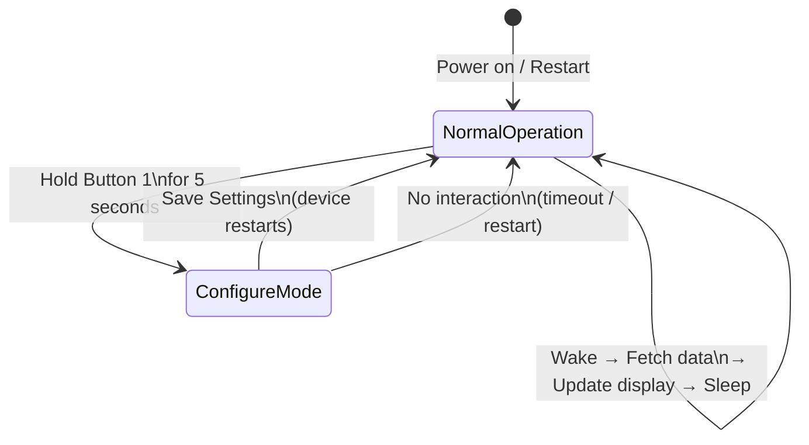

# Configure Mode

Configure Mode is the only time you can change the settings of your MyStation device. During **Normal Operation**,
configuration is intentionally disabled to save battery.

---

## Why Can't I Configure During Normal Operation?

MyStation is designed to run for months on a single battery charge. To achieve this:

- During **Normal Operation**, the device wakes up briefly to fetch data, updates the display, and goes back to
  deep sleep immediately
- Keeping the WiFi radio and web server running costs significant energy
- Running a configuration web server continuously would drain the battery in a matter of days

**Configure Mode uses more energy** because it keeps WiFi and the web server active while waiting for your input.
This is expected and acceptable for short setup sessions, but it is not suitable for continuous operation.

---

## How to Enter Configure Mode

> 📷 *[Photo placeholder: device in hand, finger on Button 1]*

1. **Press and hold Button 1** for **5 seconds**
2. The display will refresh and show the **configuration screen** with a QR code or IP address
3. MyStation is now broadcasting its own WiFi hotspot (`MyStation-XXXXXXXX`)

---

## What Happens in Configure Mode

1. MyStation opens a **WiFi Access Point** named `MyStation-XXXXXXXX`
2. Connect your phone or computer to this network (no password needed)
3. Open your browser and go to **`http://10.0.1.1`**
4. The configuration web page loads
5. Your **previously saved settings are pre-loaded** — you only need to change what you want to update
6. Make your changes and click **"Save Settings"**
7. MyStation saves all settings and **automatically restarts** into Normal Operation

> 💡 **Tip**: You don't need to re-enter everything from scratch. All previously configured values — WiFi credentials,
> stop selection, intervals, sleep schedule — are loaded automatically. Only the display mode may need to be
> re-selected if it shows the wrong default.

---

## Pre-Loaded Values in Configure Mode

When you re-enter Configure Mode, the following values are restored from the last saved configuration:

| Setting                              | Pre-loaded? |
|--------------------------------------|-------------|
| WiFi network (SSID)                  | ✅ Yes       |
| Transport stop selection             | ✅ Yes       |
| Weather update interval              | ✅ Yes       |
| Transport update interval            | ✅ Yes       |
| Sleep schedule                       | ✅ Yes       |
| Weekend mode                         | ✅ Yes       |
| Transport filters (RE, S-Bahn, Bus…) | ✅ Yes       |
| Display mode                         | ✅ Yes       |
| City / location                      | ✅ Yes       |

---

## Returning to Normal Operation

Normal Operation resumes when:

- You click **"Save Settings"** in the configuration page → device restarts automatically
- The device is manually restarted (power cycle)

---

## Factory Reset

A factory reset clears **all saved settings**, including WiFi credentials, stop selection, and all configuration.
The device will restart as if it were brand new.

> ⚠️ **This cannot be undone.** You will need to go through the full setup process again.

**To factory reset:**

1. Press and hold **Button 1 + Button 2 simultaneously** for 5 seconds
2. The display will show a reset confirmation screen
3. The device restarts and enters first-time setup mode

