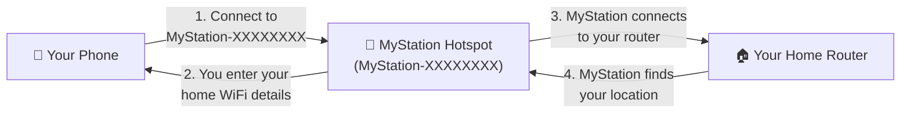
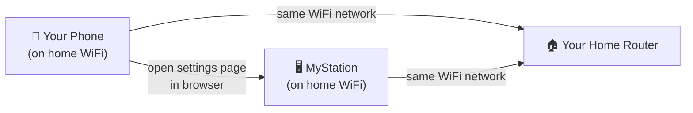
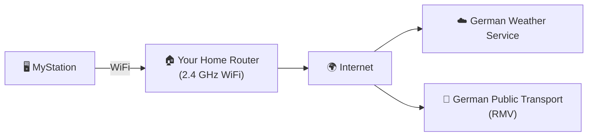

# Network Setup

MyStation needs a WiFi connection to fetch weather and transport data. This page explains what kind
of WiFi it works with, and how your phone and the device talk to each other.

---

## What You Need

| Requirement         | Details                                                                  |
|---------------------|--------------------------------------------------------------------------|
| WiFi type           | **2.4 GHz only** — the older, shorter-range WiFi standard                |
| Internet access     | Required — to fetch weather and transport data                           |
| Normal home network | Must be a standard home WiFi (not hotel or public WiFi with login pages) |

> ⚠️ **5 GHz WiFi is not supported.** Most home routers broadcast on both 2.4 GHz and 5 GHz.
> If your network name is the same for both, try looking in your router settings to find the 2.4 GHz name separately.
> Many routers label it like **"MyNetwork"** (2.4 GHz) and **"MyNetwork_5G"** (5 GHz).

---

## How the Network is Used

### Step 1 — First-Time Setup (Configure Mode)

When you first set up MyStation,
the device creates its **own temporary WiFi hotspot**. You connect your phone to it directly —
just like connecting to a café WiFi.

**What you do:**

1. Connect your phone to the **`MyStation-XXXXXXXX`** WiFi (no password needed)
2. Open your browser and go to **`http://10.0.1.1`**
3. Enter your home WiFi name and password
4. MyStation connects to your router and finds nearby transport stops automatically
5. Finish the rest of the settings and press **Save** — the device restarts

> 💡 During this step, your phone is connected directly to MyStation — not to your home WiFi.
> That is normal and expected.

---

### Step 2 — Changing Settings Later

If you want to change any settings after first-time setup (or when you hold Button 1 for 5 seconds to re-configure),
your phone and MyStation must both be connected to **the same home WiFi network**. Then you can open the settings page
in your browser.

> ⚠️ If your phone is using mobile data (4G/5G) instead of home WiFi, you will not be able
> to reach the MyStation settings page. Switch your phone to home WiFi first.

---

### Normal Operation — Daily Use

Once set up, MyStation connects to your home WiFi and fetches data from the internet automatically.

MyStation connects to the internet to:

- Get **weather data** from the German Weather Service
- Get **departure times** from the German public transport network (RMV)
- Download **software updates** automatically once per day (usually around 2–3 am)

---

## WiFi Tips

**My router has 2.4 GHz and 5 GHz with the same name**
→ Check your router settings and separate them into two different names, or ask your internet
provider. MyStation will need to connect to the 2.4 GHz one.

**MyStation connects but can't reach the settings page from my phone**
→ Make sure your phone is on home WiFi, not mobile data. Check that your router does not have
"client isolation" enabled (a setting that prevents devices on the same network from talking to each other).

**Should I place MyStation close to the router?**
→ Closer is better. A stronger signal means faster updates and less power used.
