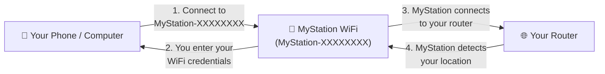
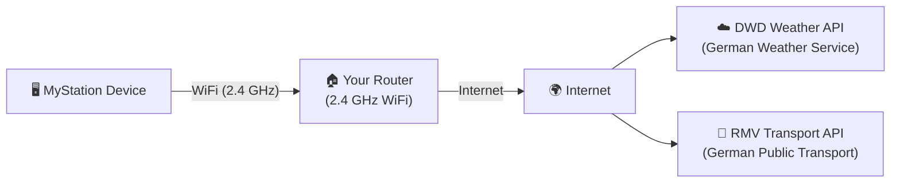
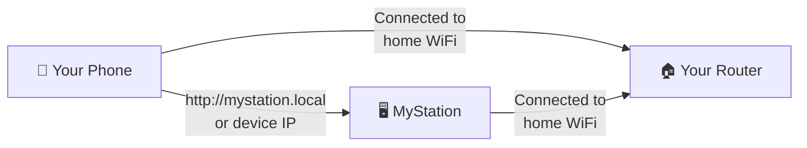

# Network Setup

MyStation needs a WiFi network to fetch weather and transport data. This page explains what is required and how the
network is used during configuration and normal operation.

## Requirements

| Requirement     | Details                                                     |
|-----------------|-------------------------------------------------------------|
| WiFi frequency  | **2.4 GHz only** — 5 GHz is not supported                   |
| Security        | WPA / WPA2 Personal                                         |
| Internet access | Required for weather and transport data                     |
| DHCP            | Must be enabled on your router                              |
| Captive portal  | Not supported (hotel/public WiFi login pages will not work) |

> ⚠️ **5 GHz is not supported.** If your router broadcasts both 2.4 GHz and 5 GHz under the same name, MyStation will
> try to connect but may fail. Use a router that has a separate 2.4 GHz SSID, or check your router settings.

---

## How the Network is Used

MyStation behaves differently depending on whether it is in **Configure Mode** or **Normal Operation**.

### Configure Mode — Setting Up the Device

When you enter Configure Mode (hold Button 1 for 5 seconds), MyStation opens its **own WiFi Access Point** so you can
connect your phone or computer directly to it.

**What happens step by step:**

1. MyStation broadcasts a WiFi hotspot named `MyStation-XXXXXXXX`
2. You connect your phone/computer to this hotspot (no password needed)
3. You open `http://10.0.1.1` in your browser to open the configuration page
4. You enter your home WiFi name and password
5. MyStation connects to your router and detects your approximate location
6. You finish the rest of the configuration in the browser
7. MyStation saves the settings and restarts into Normal Operation

> 💡 Your phone and MyStation **do not need to be on the same network** during Configure Mode. Your phone connects
> directly to MyStation's own hotspot.

---

### Normal Operation — Daily Use

Once configured, MyStation connects to your home WiFi router to fetch data from the internet.

**MyStation connects to the internet to:**

- Fetch weather data from the **German Weather Service (DWD)**
- Fetch departure data from the **RMV public transport API**
- Check for **firmware updates (OTA)** once per day (between 01:00–04:59)

> 💡 To access the configuration page **during normal operation**, your phone or computer must be connected to
> **the same WiFi network** as MyStation. You can then open the page at `http://mystation.local` or the
> device's IP address shown in the display footer.

---

## Same Network Requirement for Configuration Page

> ⚠️ **Important**: You can only access the MyStation configuration page while your phone and MyStation are both
> connected to the **same WiFi network**. If your phone is on mobile data or a different network, the page will
> not load.

---

## WiFi Tips

- **Dual-band routers**: If your router uses the same SSID for 2.4 GHz and 5 GHz, your phone may connect at 5 GHz
  while MyStation cannot. Check your router settings to separate them or use a 2.4 GHz-only SSID.
- **Signal strength**: A strong signal saves battery. Place MyStation within reasonable range of your router.
- **AP Isolation / Client Isolation**: If enabled on your router, your phone cannot reach MyStation even on the same
  network. Disable this setting in your router.
- **WPA3**: Not supported. Use WPA2 Personal.

