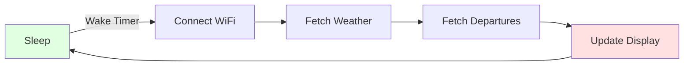

# Quick Start Guide

Get your MyStation up and running in 15 minutes!

## Prerequisites Checklist

Before you begin, make sure you have:

- [ ] MyStation device with e-paper display
- [ ] USB-C cable
- [ ] Computer with internet access (for initial firmware upload, if needed)
- [ ] WiFi network (2.4 GHz only - **5 GHz is not supported**)
- [ ] Your WiFi password

> ⚠️ **Important**: MyStation only works with **2.4 GHz WiFi networks**. 5 GHz networks are not supported due to higher
> energy consumption.

## Step 1: Power On Your Device (1 minute)

### First Power-On

1. **Connect USB-C cable** to your MyStation device
2. **Plug into computer** or USB power adapter
3. **Display will initialize** - you'll see the e-paper flash/update
4. **Look for startup screen** showing "MyStation" and WiFi setup instructions

On first boot, your device will:

- Initialize the hardware
- Create a WiFi access point for configuration
- Display a QR code or instructions on the screen

## Step 2: Connect to MyStation WiFi (2 minutes)

### Join the Configuration Network

1. **On your phone or computer**, look for a WiFi network named:
   ```
   MyStation-XXXXXXXX
   ```
   (XXXXXXXX is your device's unique ID)

2. **Connect to this network**
    - No password required
    - You may see a "No Internet" warning - this is normal

3. **Configuration portal should appear automatically**
    - If not, open your browser and go to: `http://10.0.1.1`

## Step 3: Configure Your WiFi (3 minutes)

### Connect MyStation to Your Home Network

1. **On the configuration page**, you'll see a list of available WiFi networks

2. **Select your home WiFi network**
    - ⚠️ **Make sure it's a 2.4 GHz network** (not 5 GHz)
    - Check signal strength indicator
    - If you don't see your network, click "Scan" to refresh

3. **Enter your WiFi password**
    - Password is case-sensitive
    - Make sure Caps Lock is off

4. **Click "Connect" or "Save"**

5. **Wait for confirmation**
    - Device will attempt to connect
    - May take 10-30 seconds
    - Display will show connection status

**If connection fails:**

- Double-check password
- Verify network is 2.4 GHz (not 5 GHz)
- Move device closer to router
- See [Troubleshooting](troubleshooting.md#cannot-connect-mystation-to-home-wifi)

## Step 4: Station Configuration (5 minutes)

### Access Configuration Interface

After WiFi setup, your device will:

1. Connect to your WiFi network
2. Automatically detect your location
3. Find nearby public transport stops
4. Start a configuration web server

**Access the configuration page:**

- **By mDNS**: Open `http://mystation.local` in your browser
- **By IP Address**: Check device display for IP, then open `http://192.168.1.XXX`

### Configure Your Location

The device will automatically:

1. ✅ Detect your approximate location using Google Geolocation
2. ✅ Display your city and coordinates
3. ✅ Find nearby transport stops

**If needed, you can:**

- Manually enter coordinates
- Search for a specific address
- Select a different location

### Select Your Transport Stop

1. **Review the list of nearby stops**
    - Sorted by distance
    - Shows stop name and distance

2. **Click on your preferred station**
    - Choose the stop you use most often
    - Consider which direction you travel

3. **Select transport types** you want to see:
    - ☑️ RE (Regional Express)
    - ☑️ S-Bahn (Suburban rail)
    - ☑️ U-Bahn (Metro)
    - ☑️ Bus
    - ☑️ Tram
    - ☐ Uncheck types you don't use

### Display Settings

Configure how your information is displayed:

**Update Interval**: How often to refresh data

- **5 minutes** (default) - Good balance of freshness and battery life
- **10 minutes** - Less frequent updates, better battery
- **15 minutes** - Best battery life, still useful
- Shorter intervals = fresher data but shorter battery life

**Display Mode**: What to show on screen

- **Weather + Departures** (default) - Split view, see both
- **Weather Only** - Full screen weather
- **Departures Only** - Full screen departures
- You can change this anytime with the buttons

**Sleep Schedule** (Optional): Set quiet hours

- Example: Sleep from 23:00 to 06:00
- No updates while sleeping
- Saves battery overnight
- Automatically resumes in the morning

### Save Configuration

1. **Review your settings**
2. **Click "Save Settings"**
3. **Wait for confirmation message**
4. **Device will restart** and begin normal operation

## Step 5: Verify Operation (2 minutes)

### Check the Display

Your e-paper display should now show:

**In Weather + Departures mode:**

- 🌤️ Current weather (top section)
- 🚌 Upcoming departures (bottom section)
- ⏰ Last update time (footer)
- 🔋 Battery status (footer)

**Update Process:**
You'll see the display refresh:

1. Screen flashes (black/white) - this is normal for e-paper
2. Takes 30-45 seconds to fully update
3. New information appears
4. Device goes to sleep until next update

### Normal Operation Cycle



Your MyStation will:

1. **Wake up** at your configured interval (e.g., every 5 minutes)
2. **Connect** to your WiFi network
3. **Fetch** latest weather and departure data
4. **Update** the e-paper display
5. **Sleep** to save battery

This happens automatically - no intervention needed!

## Using the Physical Buttons

Your MyStation has 3 buttons for quick control:

**Button 1** (Left): Weather + Departures view
**Button 2** (Middle): Weather only view
**Button 3** (Right): Departures only view

**To change display mode:**

1. Press the button for the view you want
2. Device wakes up immediately
3. Fetches fresh data
4. Updates display to show requested view
5. After 2 minutes, returns to configured mode

**Long press Button 1** (5 seconds during power-on): Factory reset

See [Button Controls](button-controls.md) for detailed usage.

## Battery Installation (Optional)

### For Wireless Operation

1. **Power off** the device (unplug USB)
2. **Connect LiPo battery** to the JST connector
    - Match polarity: Red to red, black to black
    - Connector only fits one way
3. **Power on** and verify operation
4. **Unplug USB** for battery-only operation

### Battery Life Expectations

With a 2000mAh battery:

- **5-minute updates**: 2-4 weeks
- **10-minute updates**: 4-8 weeks
- **15-minute updates**: 6-12 weeks

**Tips for longer battery life:**

- Increase update interval to 10-15 minutes
- Enable sleep schedule (no updates overnight)
- Ensure strong WiFi signal (weak signal uses more power)

## What's Next?

### Your MyStation is Now Running!

It will automatically:

- ✅ Wake up at your configured interval
- ✅ Connect to your 2.4 GHz WiFi network
- ✅ Update weather and departure information
- ✅ Go back to sleep to save battery
- ✅ Retain all settings even if power is lost

### Learn More

- 📖 [Understanding the Display](understanding-display.md) - What all the information means
- 🔘 [Button Controls](button-controls.md) - Using the physical buttons
- 🔋 Battery & Charging - Battery care guide (coming soon)

### Need to Make Changes?

**Access the configuration interface anytime:**

- Open `http://mystation.local` in your browser
- Or use the IP address shown on the display
- Update any settings
- Click "Save" to apply changes

**Factory reset:**

- Hold Button 1 for 5 seconds during power-on

## Troubleshooting

### Can't Find MyStation WiFi Network

**Solutions:**

1. Wait 30-60 seconds after power-on
2. Check your phone/computer is looking for 2.4 GHz networks
3. Try powering off and on again
4. Look for any network starting with "MyStation-"

### Can't Connect to Home WiFi

**Most common cause:** Trying to use a 5 GHz network

**Solutions:**

1. ⚠️ **Verify your network is 2.4 GHz** (not 5 GHz)
2. Check password is correct (case-sensitive)
3. Move device closer to router
4. Check router allows new devices to connect
5. See [Troubleshooting WiFi](troubleshooting.md#wifi--network-issues)

### Display Not Updating

**Solutions:**

1. Check WiFi is connected (look for WiFi icon in footer)
2. Wait for next scheduled update
3. Press any button to force an immediate update
4. Check battery level (if on battery power)
5. See [Troubleshooting Display](troubleshooting.md#display-issues)

### No Nearby Stops Found

**Solutions:**

1. Verify internet connection is working
2. Check you're in an area covered by RMV (Germany)
3. Try manual location entry
4. See [Troubleshooting](troubleshooting.md#no-nearby-stops-found)

For more help, see the complete [Troubleshooting Guide](troubleshooting.md).

---

## Quick Reference

### Important URLs

- Configuration: `http://mystation.local` or device IP address
- WiFi setup portal: `http://10.0.1.1` (when in setup mode)

### Important Notes

- ⚠️ **2.4 GHz WiFi only** - 5 GHz not supported
- 🔋 Battery life: 2-12 weeks depending on update interval
- 🔄 Auto-updates every 5 minutes (configurable)
- 💾 Settings persist across power loss
- 🌍 Optimized for German public transport (RMV) and weather (DWD)

### Button Quick Reference

- **Button 1**: Weather + Departures
- **Button 2**: Weather only
- **Button 3**: Departures only
- **Button 1 (5s hold)**: Factory reset

---

**Congratulations!** Your MyStation is now set up and running! 🎉

For more information, see:

- [Understanding the Display](understanding-display.md)
- [Button Controls](button-controls.md)
- [Troubleshooting](troubleshooting.md)
