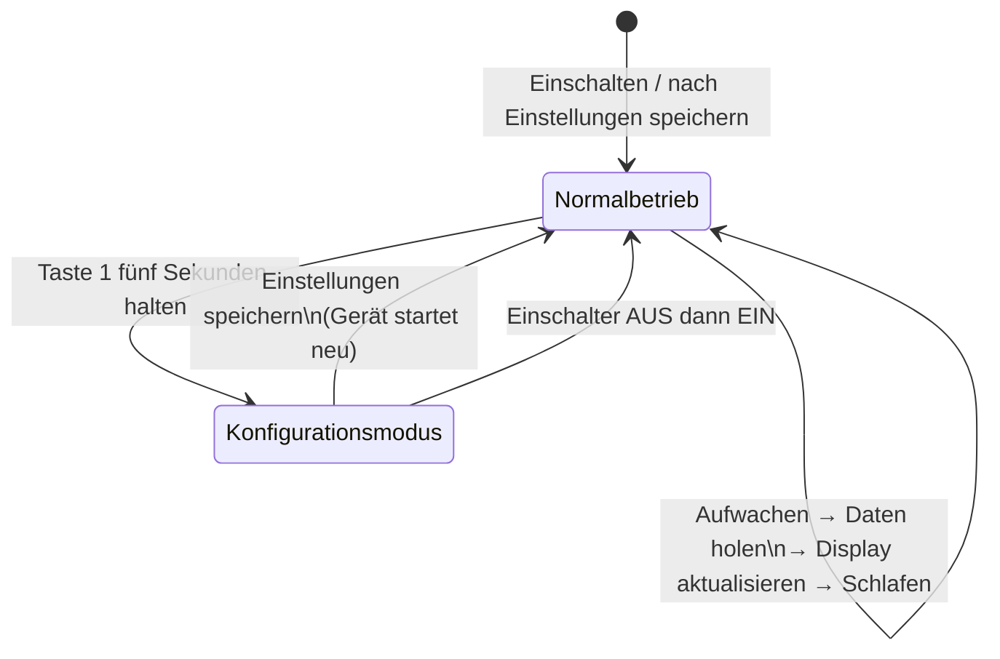

# Einstellungen ändern

Der Konfigurationsmodus ist die einzige Zeit, in der du die Einstellungen deines MyStation ändern kannst.
Im normalen Betrieb ist der Einstellungsbildschirm nicht verfügbar — und das ist so gewollt.

---

## Warum kann ich nur im Konfigurationsmodus konfigurieren?

MyStation ist darauf ausgelegt, monatelang mit einer einzigen Akkuladung zu laufen. Dazu verbringt
es die meiste Zeit in einem sehr energiesparenden Schlafzustand. Es wacht kurz auf, holt Daten,
aktualisiert das Display und geht sofort wieder schlafen.

Den Einstellungsbildschirm offen zu halten würde viel mehr Energie verbrauchen.
Daher ist er nur verfügbar, wenn du ihn bewusst einschaltest — das ist der **Konfigurationsmodus**.

> 🔋 Stell dir vor: Der Konfigurationsmodus ist wie ein Laden, der nur öffnet, wenn du anklopfst.
> Wenn du fertig bist, schließt er wieder, um Energie zu sparen.

---

## Wie du den Konfigurationsmodus öffnest

1. **Taste 1** (die linke Taste) für **5 Sekunden gedrückt halten**
2. Das Display aktualisiert sich und zeigt einen Einrichtungsbildschirm mit einem Link oder QR-Code
3. MyStation sendet jetzt seinen eigenen WLAN-Hotspot namens **`MyStation-XXXXXXXX`**

---

## Die Einstellungsseite öffnen

1. Öffne auf deinem Handy die **WLAN-Einstellungen**
2. Verbinde dich mit **`MyStation-XXXXXXXX`** (kein Passwort nötig)
3. Öffne deinen Browser und gehe zu **`http://10.0.1.1`**
4. Die MyStation-Einstellungsseite erscheint

---

## Deine vorherigen Einstellungen sind bereits geladen

Du musst nicht jedes Mal von vorne anfangen. Wenn der Konfigurationsmodus geöffnet wird,
sind alle vorherigen Einstellungen bereits vorausgefüllt:

| Einstellung               | Gespeichert? |
|---------------------------|--------------|
| Heimnetzwerk              | ✅ Ja         |
| Haltestelle               | ✅ Ja         |
| Anzeigemodus              | ✅ Ja         |
| Aktualisierungsintervalle | ✅ Ja         |
| Schlafplan                | ✅ Ja         |
| Wochenendmodus            | ✅ Ja         |
| Verkehrsmittelfilter      | ✅ Ja         |
| Standort                  | ✅ Ja         |

Ändere einfach, was du brauchst, und drücke **Einstellungen speichern**.

---

## Speichern und zum Normalbetrieb zurückkehren

Sobald du **„Einstellungen speichern"** drückst, speichert MyStation alles und **startet automatisch neu**.
Der Normalbetrieb wird innerhalb von ca. 30 Sekunden wieder aufgenommen.

Du kannst den Konfigurationsmodus auch ohne Speichern verlassen, indem du den Einschalter auf AUS
und dann zurück auf EIN schiebst. Deine vorherigen Einstellungen bleiben dabei unverändert.

---

## Alle Einstellungen löschen (Werksreset)

Ein Werksreset löscht alles: dein WLAN, deine Haltestelle und alle Konfigurationen.
Verwende dies nur, wenn du das Gerät komplett neu einrichten möchtest.

> ⚠️ **Dies kann nicht rückgängig gemacht werden.** Du musst die komplette Einrichtung erneut durchführen.

**So führst du einen Werksreset durch:**

1. **Taste 1 + Taste 2 gleichzeitig** für **5 Sekunden** gedrückt halten
2. Das Display zeigt eine Reset-Bestätigung
3. Das Gerät startet neu wie fabrikneu — folge dem [Schnellstart](quick-start.md)

