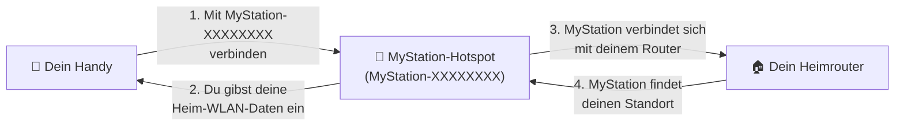
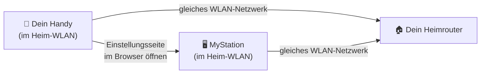
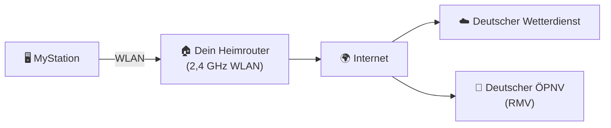

# WLAN & Netzwerk

MyStation benötigt eine WLAN-Verbindung, um Wetter- und Abfahrtsdaten abzurufen. Diese Seite erklärt,
welches WLAN funktioniert und wie dein Handy und das Gerät miteinander kommunizieren.

---

## Was du brauchst

| Anforderung           | Details                                                                                 |
|-----------------------|-----------------------------------------------------------------------------------------|
| WLAN-Typ              | **Nur 2,4 GHz** — der ältere, kürzreichweitige WLAN-Standard                            |
| Internetzugang        | Erforderlich — zum Abrufen von Wetter- und Abfahrtsdaten                                |
| Normales Heimnetzwerk | Muss ein normales Heim-WLAN sein (kein Hotel- oder öffentliches WLAN mit Anmeldeseiten) |

> ⚠️ **5 GHz WLAN wird nicht unterstützt.** Die meisten Heimrouter senden auf 2,4 GHz und 5 GHz.
> Wenn dein Netzwerkname für beide gleich ist, schau in den Router-Einstellungen nach dem 2,4 GHz-Namen.
> Viele Router beschriften es wie **„MeinNetzwerk"** (2,4 GHz) und **„MeinNetzwerk_5G"** (5 GHz).

---

## Wie das Netzwerk genutzt wird

### Schritt 1 — Ersteinrichtung (Konfigurationsmodus)

Bei der ersten Einrichtung erstellt das Gerät seinen **eigenen temporären WLAN-Hotspot**.
Du verbindest dein Handy direkt damit — wie bei einem Café-WLAN.

**Was du tust:**

1. Verbinde dein Handy mit dem **`MyStation-XXXXXXXX`** WLAN (kein Passwort nötig)
2. Öffne deinen Browser und gehe zu **`http://10.0.1.1`**
3. Gib deinen Heimnetzwerk-Namen und dein Passwort ein
4. MyStation verbindet sich mit deinem Router und findet automatisch nahegelegene Haltestellen
5. Schließe die restlichen Einstellungen ab und drücke **Speichern** — das Gerät startet neu

> 💡 In diesem Schritt ist dein Handy direkt mit MyStation verbunden — nicht mit deinem Heim-WLAN.
> Das ist normal und erwartet.

---

### Schritt 2 — Einstellungen später ändern

Wenn du Einstellungen nach der Ersteinrichtung ändern möchtest (oder wenn du Taste 1 für 5 Sekunden
hältst, um neu zu konfigurieren), müssen dein Handy und MyStation beide mit dem
**gleichen Heimnetzwerk** verbunden sein. Dann kannst du die Einstellungsseite im Browser öffnen.

> ⚠️ Wenn dein Handy mobiles Internet (4G/5G) statt Heim-WLAN verwendet, kannst du die
> MyStation-Einstellungsseite nicht erreichen. Wechsle zuerst zu deinem Heim-WLAN.

---

### Normaler Betrieb — Tägliche Nutzung

Nach der Einrichtung verbindet sich MyStation mit deinem Heim-WLAN und ruft automatisch Daten ab.

MyStation verbindet sich mit dem Internet um:

- **Wetterdaten** vom Deutschen Wetterdienst abzurufen
- **Abfahrtszeiten** vom deutschen ÖPNV-Netzwerk (RMV) abzurufen
- **Softwareupdates** automatisch einmal täglich herunterzuladen (normalerweise ca. 2–3 Uhr)

---

## WLAN-Tipps

**Mein Router hat 2,4 GHz und 5 GHz mit demselben Namen**
→ Prüfe deine Router-Einstellungen und trenne sie in zwei verschiedene Namen,
oder frage deinen Internetanbieter. MyStation muss sich mit dem 2,4 GHz-Netzwerk verbinden.

**MyStation verbindet sich, aber ich kann die Einstellungsseite nicht vom Handy aus erreichen**
→ Stelle sicher, dass dein Handy über Heim-WLAN verbunden ist, nicht über mobiles Internet.
Prüfe, ob dein Router „Client-Isolation" aktiviert hat (eine Einstellung, die verhindert, dass
Geräte im gleichen Netzwerk miteinander kommunizieren).

**Sollte MyStation nah am Router stehen?**
→ Näher ist besser. Ein stärkeres Signal bedeutet schnellere Updates und weniger Stromverbrauch.

